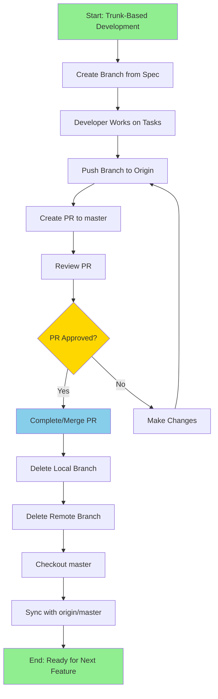

# Spec Requirements Document

> Spec: Trunk-Based Development Workflow
> Created: 2025-07-25
> Status: Planning

## Overview

Implement an automated trunk-based development workflow system that standardizes git operations and ensures consistent branch management practices. This feature will streamline the development process from feature branch creation through PR completion and cleanup.

### Future Update Prompt

For future modifications to this spec, use the following prompt:
```
Update the trunk-based development workflow spec to include:
- Additional git workflow automation features
- Enhanced PR review capabilities
- Integration with CI/CD systems
- Branch protection rule configurations
- Automated conflict resolution strategies
Maintain compatibility with existing git operations and preserve the current trunk-based development principles.
```

## User Stories

### Developer Workflow Automation

As a developer, I want to have automated git workflow commands, so that I can focus on coding rather than remembering git command sequences.

When working on a new feature, the developer should be able to:
1. Automatically create a branch based on the current spec name
2. Work on their tasks with confidence that the branch is properly set up
3. Push their changes to the remote repository with a single command
4. Create a pull request with pre-filled information
5. Have the system handle branch cleanup after PR completion

This workflow ensures consistency across the team and reduces common git-related errors like working on the wrong branch or forgetting to sync with master.

### Team Lead Oversight

As a team lead, I want standardized git workflows across my team, so that code reviews and merges follow consistent patterns.

The team lead benefits from:
- Predictable branch naming conventions tied to specs
- Consistent PR creation with proper descriptions
- Automated cleanup reducing branch clutter
- Clear workflow status visibility

## Spec Scope

1. **Branch Creation from Spec** - Automatically create and checkout branches based on spec folder names
2. **Workflow Status Tracking** - Monitor current branch status and provide guidance on next steps
3. **PR Automation** - Create pull requests with spec-based descriptions and proper targeting
4. **Branch Cleanup** - Automated removal of local and remote branches after PR completion
5. **Master Synchronization** - Ensure local master stays in sync with origin/master

## Out of Scope

- Automated merge conflict resolution
- CI/CD pipeline integration
- Branch protection rule management
- Automated code review assignments
- Git hooks configuration

## Expected Deliverable

1. A set of Python functions or CLI commands that automate the entire trunk-based development workflow
2. Clear console output showing workflow progress and any required user actions
3. Proper error handling for common git workflow issues (uncommitted changes, conflicts, etc.)

## Workflow Summary



### Workflow Steps Explained

1. **Create Branch from Spec**: Automatically generate branch name from spec folder (excluding date prefix)
2. **Developer Work**: Allow developer to complete their tasks independently
3. **Push to Origin**: Push all commits to remote repository
4. **Create PR**: Generate pull request with spec details and proper base branch
5. **Review Process**: Standard PR review workflow
6. **Complete PR**: Merge the PR into master branch
7. **Cleanup**: Remove both local and remote feature branches
8. **Synchronize**: Update local master with latest changes

## Spec Documentation

- Tasks: @.agent-os/specs/2025-07-25-trunk-based-development-workflow/tasks.md
- Technical Specification: @.agent-os/specs/2025-07-25-trunk-based-development-workflow/sub-specs/technical-spec.md
- API Specification: @.agent-os/specs/2025-07-25-trunk-based-development-workflow/sub-specs/api-spec.md
- Tests Specification: @.agent-os/specs/2025-07-25-trunk-based-development-workflow/sub-specs/tests.md