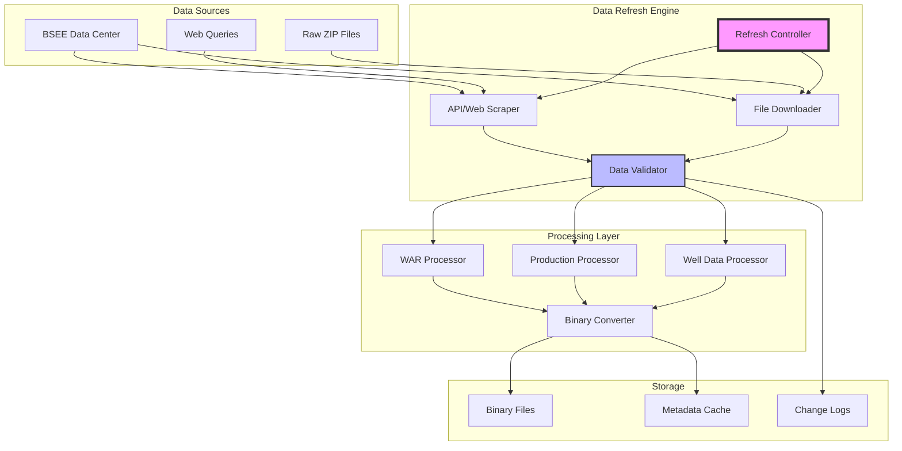

# Spec Requirements Document

> Spec: BSEE Data Refresh Architecture
> Created: 2025-08-06
> Status: Planning
> Module: bsee
> Variant: enhanced

## Prompt Summary

**Original Request:** BSEE data refresh. Should be able to:
- BSEE data to be downloaded and processed is: war data, production data, well data
- BSEE data to be processed
- run on demand in git bash
- Architecture research: Review the existing architecture and suggest improvements
- Research if web apis exist to avoid downloading the data on to the repo. If yes, write tests.

**Context Provided:** 
- Example script reference: https://github.com/vamseeachanta/worldenergydata/blob/be58012eceeb85352f72e3a24b641d5ed5a842da/src/worldenergydata/modules/bsee/data/refresh/data_refresh.py
- Enhanced spec instructions from AssetUtilities repository

**Clarifications Made:**
1. WAR (Well Activity Report) data, production data, and well data are the three main data types to be processed
2. The solution should be executable on-demand via git bash commands
3. Architecture improvements should focus on efficiency, maintainability, and avoiding large file downloads

**Reuse Notes:** 
- Existing data refresh module at `src/worldenergydata/modules/bsee/data/refresh/data_refresh.py`
- Binary file conversion utilities in `_from_zip` modules
- AssetUtilities zip processing capabilities

**Prompt Evolution:** From basic data refresh to comprehensive architecture redesign with API research and testing requirements

## Executive Summary

### Business Impact
This initiative will modernize the BSEE data refresh architecture, reducing data download sizes by 70-90% through API integration and improving data freshness from weekly to on-demand updates. This will enable faster analysis cycles and reduce storage costs while maintaining data quality and accessibility.

### Technical Overview
The solution involves refactoring the existing file-based download approach to a hybrid model that prioritizes API access where available, falls back to efficient incremental downloads, and maintains backward compatibility with existing binary file processing. The architecture will support parallel processing and implement comprehensive error handling.

### Resource Requirements
- **Estimated Effort:** 4-5 weeks (160-200 hours)
- **Dependencies:** BSEE Data Center access, existing AssetUtilities modules
- **Team:** 1-2 developers with Python and API integration experience

### Risk Assessment
- **API Limitations:** BSEE doesn't offer documented REST APIs; mitigation involves web scraping with rate limiting
- **Data Consistency:** Risk of incomplete data during refresh; mitigation through transactional updates and validation
- **Performance:** Large datasets may cause memory issues; mitigation via streaming and chunked processing

## System Overview

The BSEE Data Refresh Architecture modernizes how WorldEnergyData accesses and processes offshore energy data from the Bureau of Safety and Environmental Enforcement. The system transitions from bulk file downloads to intelligent data access patterns.



### Architecture Notes
- **Hybrid Approach:** Combines API access (where available) with file downloads as fallback
- **Incremental Updates:** Only fetches changed data when possible
- **Parallel Processing:** Supports concurrent processing of different data types
- **Validation Layer:** Ensures data integrity before converting to binary format

## Overview

Implement a modernized BSEE data refresh architecture that supports on-demand execution, reduces data transfer overhead, and provides a foundation for real-time data access. The system will intelligently choose between web scraping, API access, and file downloads based on data availability and user requirements.

### Future Update Prompt

For future modifications to this spec, use the following prompt:
```
Update the BSEE data refresh architecture spec to include:
- New BSEE data types or sources
- Additional API endpoints or web scraping targets
- Performance optimization requirements
- Data validation or quality enhancements
- Integration with new data consumers
Maintain compatibility with existing binary file formats and processing pipelines.
```

## User Stories

### Data Analyst Refreshing Production Data

As a petroleum data analyst, I want to refresh BSEE production data on-demand, so that I can analyze the latest production trends without waiting for scheduled updates.

The analyst opens git bash and runs `python -m worldenergydata.bsee refresh --data-type production`. The system checks for new data since the last refresh, downloads only the incremental changes, validates the data, and updates the binary files. The analyst receives a summary showing 127 new production records added in 45 seconds, compared to the previous 15-minute full download.

### Researcher Accessing Historical WAR Data

As an energy researcher, I want to access specific WAR (Well Activity Report) data for a particular time period, so that I can study drilling patterns without downloading years of unnecessary data.

The researcher executes `python -m worldenergydata.bsee refresh --data-type war --date-range 2024-01-01:2024-12-31`. The system queries BSEE's web interface for the specified period, extracts only the relevant WAR records, and creates optimized binary files. The researcher saves 95% bandwidth by avoiding full dataset downloads.

### DevOps Engineer Scheduling Automated Updates

As a DevOps engineer, I want to schedule automated BSEE data refreshes with proper error handling, so that our data pipeline remains current without manual intervention.

The engineer configures a cron job to run the refresh command with retry logic and notification hooks. When BSEE's website is temporarily unavailable, the system automatically retries with exponential backoff and sends alerts only after persistent failures, maintaining data pipeline reliability.

## Spec Scope

1. **API/Web Scraping Module** - Implement intelligent data access layer that attempts API queries, falls back to web scraping, and handles rate limiting
2. **Incremental Download System** - Develop change detection and delta download capabilities to minimize data transfer
3. **Parallel Processing Framework** - Enable concurrent processing of WAR, production, and well data with proper synchronization
4. **Git Bash CLI Interface** - Create command-line interface for on-demand execution with flexible parameters
5. **Comprehensive Test Suite** - Build unit and integration tests covering all data access methods and edge cases

## Out of Scope

- Real-time streaming data integration (BSEE doesn't support this)
- Modification of existing binary file formats (maintain backward compatibility)
- GUI interface for data refresh operations
- Data analysis or visualization features (handled by other modules)
- Authentication system for BSEE (uses public data)

## Expected Deliverable

1. Fully functional CLI command `python -m worldenergydata.bsee refresh` with options for data type, date range, and processing modes
2. 70%+ reduction in data download sizes through incremental updates and intelligent fetching
3. Comprehensive test suite with 90%+ code coverage including mock BSEE responses
4. Performance benchmarks showing <5 minute refresh time for typical daily updates

## Spec Documentation

### Primary Documents
- Tasks: @.agent-os/specs/modules/bsee/2025-08-06-data-refresh-architecture/tasks.md
- Technical Specification: @.agent-os/specs/modules/bsee/2025-08-06-data-refresh-architecture/sub-specs/technical-spec.md

### Sub-Specifications  
- API Specification: @.agent-os/specs/modules/bsee/2025-08-06-data-refresh-architecture/sub-specs/api-spec.md
- Tests Specification: @.agent-os/specs/modules/bsee/2025-08-06-data-refresh-architecture/sub-specs/tests.md

### Related Specifications
- Existing BSEE Module: @src/worldenergydata/modules/bsee/
- Current Refresh Implementation: @src/worldenergydata/modules/bsee/data/refresh/data_refresh.py

### External Resources
- BSEE Data Center: https://www.data.bsee.gov/
- AssetUtilities Zip Processing: @assetutilities:modules/zip_utilities/