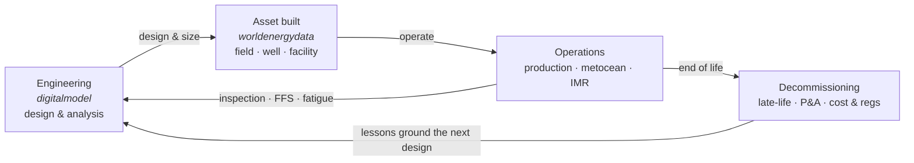
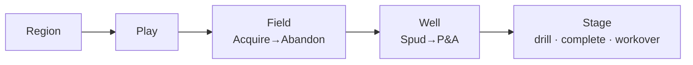
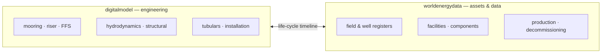

# WorldEnergyData

> *Everyday complex engineering — made deterministically simple.*

> **Part of the Deckhand API — the API for real-world work.**
> The public-domain datasets and analyses in this repo feed **Deckhand API paths** (field economics,
> well benchmarking, basin/decom intel): one call (`POST /api/run`) returns a **standards-traceable
> HTML report URL** — deterministic, built on real code and public federal data (same input, same
> output, every time).
> Live API paths → https://aceengineer.com/api-catalog.html · API reference: deckhand `docs/deckhand/API.md`
>
> **Explore the capabilities** → https://vamseeachanta.github.io/worldenergydata/capabilities/ — every live surface with a 1-page PDF, a self-contained workflow-API call, and a ready-to-run starting prompt.

A comprehensive Python data library and analysis platform for the energy industry, providing integrated access to public energy data sources with built-in economic evaluation, safety analysis, and production forecasting tools.

## Why this exists — the engineering ↔ asset circle

`digitalmodel` and `worldenergydata` are two halves of one loop.

- **digitalmodel** is the engineering brain — deterministic, code-based analysis (mooring, riser, fitness-for-service, hydrodynamics, structural, tubulars, installation): *what is possible and safe via engineering*.
- **worldenergydata** is the real-world asset ledger — public-source, reproducible field / well / facility data across the whole life cycle: *what was actually built, and how it performs*.

Together they close a circle. Engineering designs an asset; it gets built and operated; operations feed back into engineering (inspection, fitness-for-service, fatigue re-assessment); at end of life it is decommissioned — itself an engineering problem — and the outcomes loop back as empirical priors for the next design. The **life-cycle timeline** is the shared spine: `worldenergydata` supplies each stage's real dates and assets, `digitalmodel` supplies each stage's engineering.



The same stage-gate timeline is **fractal** — one grammar that reads coherently from a whole region down to a single wellbore stage:



And the two repos meet at that timeline — each asset on a field page can show *what is possible via engineering*:



Live: [worldenergydata field life-cycle](https://vamseeachanta.github.io/worldenergydata/lifecycle/) · [digitalmodel engineering capabilities](https://vamseeachanta.github.io/digitalmodel/capabilities/)

This repo is the **asset & data** half of that loop — the public-source field/well/facility ledger the engineering runs against.

## Overview

WorldEnergyData helps energy industry professionals, data analysts, researchers, and consultants make data-driven decisions by providing:

- **Unified CLI**: Single command-line interface for all modules (`worldenergydata <module> <command>`)
- **Data Access**: Automated collection from multiple public sources (BSEE, USCG, NTSB, MAIB)
- **Economic Analysis**: NPV, MIRR, IRR calculations with industry-standard methodology
- **Safety Tracking**: Marine safety incident data from global maritime authorities

## Quick Start

### Installation

```bash
# Install UV package manager (recommended)
curl -LsSf https://astral.sh/uv/install.sh | sh

# Clone and setup
git clone https://github.com/username/worldenergydata.git
cd worldenergydata
uv sync

# Populate BSEE data (not stored in git, ~300 MB download)
make data
# or: python3 scripts/refresh_bsee_all.py

# Verify installation
uv run worldenergydata --help
```

> **Note**: BSEE analysis modules require local data that is not stored in git.
> Run `make data` after cloning to download datasets. See [Local Data Pattern](docs/data/LOCAL_DATA_PATTERN.md).

### Basic Usage

**Safe first commands — no data or network required:**

```bash
# Discover all modules and commands
uv run worldenergydata --help
uv run worldenergydata info
uv run worldenergydata version

# Financial calculations (no data required)
uv run worldenergydata fdas calculate-npv --cashflows "[-1000,100,200,300]" --discount-rate 0.10
uv run worldenergydata fdas calculate-all --cashflows "[-5000,1000,1500,2000]"
uv run worldenergydata forecast --help
```

**Data-required commands** (run `make data` first):

```bash
# BSEE data analysis — requires local BSEE dataset (~300 MB)
uv run worldenergydata bsee analyze --field "Jack"
uv run worldenergydata bsee report --type block --id 759 --format excel
```

**Network/credential-required commands:**

```bash
# Marine safety — requires network access
uv run worldenergydata marine-safety scrape uscg --start-year 2020  # ⚠ network
uv run worldenergydata marine-safety stats --source all

# EIA data feed — requires EIA API key
uv run worldenergydata eia fetch  # ⚠ credential-required
```

> **Note:** `bsee refresh`, `marine-safety scrape`, and scheduler commands download large datasets.
> See [MODULE_INDEX.md](MODULE_INDEX.md) for the full module list and data prerequisites.
> See [docs/CLI.md](docs/CLI.md) for complete CLI reference with safety classifications.

For full module discovery: **[MODULE_INDEX.md](MODULE_INDEX.md)** covers all 16 CLI sub-apps and data readiness status.

## Modules

### BSEE Module (`worldenergydata bsee`)
Gulf of Mexico offshore oil & gas data from the Bureau of Safety and Environmental Enforcement:
- Well and production data (API10/API12 formats)
- Production analysis and reporting
- Financial analysis (NPV, cash flow)
- Comprehensive multi-format exports (Excel, JSON, HTML, PDF)

```bash
worldenergydata bsee analyze --block 759
worldenergydata bsee report --type field --id "Thunder Horse" --oil-price 80
worldenergydata bsee data --api 608114001200
worldenergydata bsee refresh --type production
```

### Marine Safety Module (`worldenergydata marine-safety`)
Marine safety incident tracking from global maritime authorities:
- USCG MISLE database
- NTSB marine accident investigations
- UK MAIB reports
- TSB Canada data

```bash
worldenergydata marine-safety scrape uscg --start-year 2020 --end-year 2023
worldenergydata marine-safety db init --dev-mode
worldenergydata marine-safety export csv --output incidents.csv
worldenergydata marine-safety stats --verbose
```

### FDAS Module (`worldenergydata fdas`)
Field Development Analysis System for deepwater project economics:
- Excel-compatible MIRR calculations
- NPV with customizable discount rates
- IRR calculations (monthly/annual)
- Water depth classification

```bash
worldenergydata fdas calculate-npv --cashflows "[-1000,100,200,300,400,500]"
worldenergydata fdas calculate-mirr --cashflows "[-5000,1000,1500,2000]" --discount-rate 0.12
worldenergydata fdas analyze --field "Thunder Horse" --discount-rate 0.10
worldenergydata fdas classify 5000
```

## Project Structure

```
worldenergydata/
├── src/worldenergydata/
│   ├── cli/                    # Unified CLI (Typer-based)
│   │   ├── main.py             # Main entry point
│   │   └── commands/           # Module-specific commands
│   ├── common/                 # Shared utilities
│   │   ├── logging.py          # Centralized logging
│   │   ├── config.py           # Configuration management
│   │   ├── exceptions.py       # Custom exceptions
│   │   └── types.py            # Type definitions
│   └── modules/
│       ├── bsee/               # BSEE data module
│       │   ├── data/           # Data loaders and sources
│       │   ├── analysis/       # Analysis tools
│       │   └── reports/        # Report generation
│       ├── marine_safety/      # Marine safety module
│       │   ├── scrapers/       # Data scrapers
│       │   ├── database/       # Database operations
│       │   └── analysis/       # Incident analysis
│       └── fdas/               # Field Development Analysis
│           ├── core/           # Financial calculations
│           ├── adapters/       # BSEE integration
│           └── analysis/       # Cashflow modeling
├── data/                       # Data storage (raw/processed)
├── tests/                      # Test suite
├── docs/                       # Documentation
│   ├── CLI.md                  # CLI reference
│   └── MIGRATION_GUIDE.md      # Migration from old structure
└── pyproject.toml              # Project configuration
```

## Installation Options

### Using UV (Recommended)

```bash
# Install UV
curl -LsSf https://astral.sh/uv/install.sh | sh

# Clone and install
git clone https://github.com/username/worldenergydata.git
cd worldenergydata
uv sync

# Run
uv run worldenergydata --help
```

### Using pip

```bash
# Install from source
pip install -e .

# With development dependencies
pip install -e ".[dev]"
```

## Development

### Testing

```bash
# Run all tests
uv run pytest

# With coverage
uv run pytest --cov=src --cov-report=html

# Specific module
uv run pytest tests/modules/test_bsee.py
```

### Code Quality

```bash
# Format
uv run black .
uv run isort .

# Lint
uv run ruff check .

# Type check
uv run mypy src/
```

### Adding Dependencies

```bash
uv add requests           # Runtime dependency
uv add --dev pytest-cov   # Development dependency
```

## Documentation

- **[CLI Reference](docs/CLI.md)**: Complete CLI command documentation
- **[Migration Guide](docs/MIGRATION_GUIDE.md)**: Migrating from old import paths
- **[API Documentation](docs/api/)**: Module API reference

## Technology Stack

| Category | Tools |
|----------|-------|
| Language | Python 3.9+ |
| Package Manager | UV |
| CLI Framework | Typer + Rich |
| Data Processing | pandas, numpy, numpy-financial |
| Web Scraping | Scrapy, Selenium, BeautifulSoup4 |
| Database | SQLAlchemy, PostgreSQL/SQLite |
| Testing | pytest |
| Code Quality | black, isort, ruff, mypy |

## Contributing

1. Fork the repository
2. Create a feature branch (`git checkout -b feature/new-feature`)
3. Write tests first (TDD)
4. Implement your changes
5. Run quality checks (`uv run pytest && uv run ruff check .`)
6. Submit a pull request

## License

MIT License - see [LICENSE](LICENSE) for details.

## Acknowledgments

- Bureau of Safety and Environmental Enforcement (BSEE)
- US Coast Guard (USCG)
- National Transportation Safety Board (NTSB)
- UK Marine Accident Investigation Branch (MAIB)

---

**Note**: This project is for analysis of public energy data sources. Verify data accuracy and comply with source provider terms.
