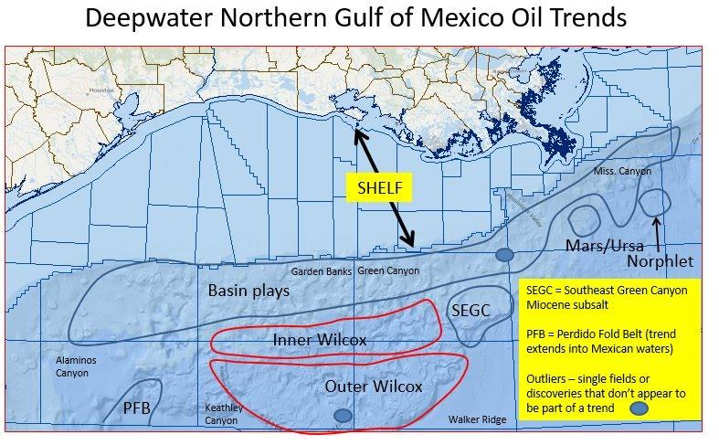
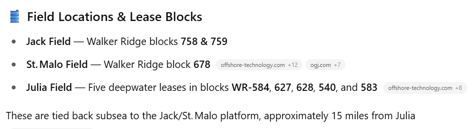
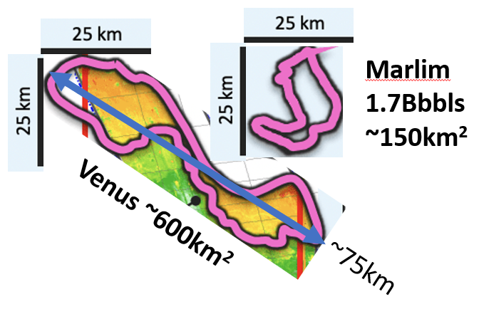

## Objective

A schematic similar to below:

https://www.google.com/maps/@27.480989,-90.1161697,1079447m/data=!3m1!1e3?entry=ttu&g_ep=EgoyMDI1MDYwOS4xIKXMDSoASAFQAw%3D%3D

### Communications

Chuck,

We have not gone in that direction yet. 

If you do have the demarcation (rough) coordinates of those curves etc. , I can give a try using a geospatial software.

Thank you,
Vamsee

On Wed, Jun 11, 2025 at 5:04 PM <chuck.white@frontierdeepwater.com> wrote:
Vamsee, have y’all generated or can you generate a map showing these blocks in one image?

I’ve tried with AI and am not getting what I need. I’m putting together a post comparing these fields to TotalEnergies’ VENUS discovery. Check out the size of VENUS… Phase one is expected to exploit around 920 million barrels of oil.

 

Best wishes,

   CWhite

Charles N. White

EVP, Frontier Deepwater Appraisal Solutions LLC

LP SDP, Fellow IMarEST & SNAME

Houston/Spicewood

Mob. +1.832.745.6348

“When a game change is possible, just trying to optimize what your company is already doing is losing!”