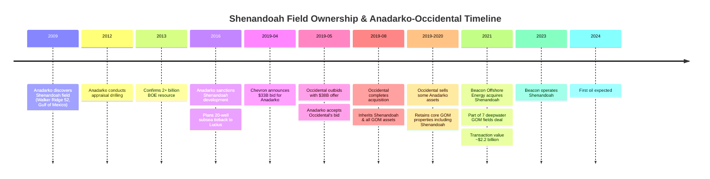

Prompt:

show mermaid timeline of anadarko's shenandoah gulf of mexico field changing hands and then occidental's acquisition of anadarko

```mermaid
timeline
    title Shenandoah Field Ownership & Anadarko-Occidental Timeline
    2009 : Anadarko discovers Shenandoah field (Walker Ridge 52, Gulf of Mexico)
    2012 : Anadarko conducts appraisal drilling
    2013 : Confirms 2+ billion BOE resource
    2016 : Anadarko sanctions Shenandoah development : Plans 20-well subsea tieback to Lucius
    2019-04 : Chevron announces $33B bid for Anadarko
    2019-05 : Occidental outbids with $38B offer : Anadarko accepts Occidental's bid
    2019-08 : Occidental completes acquisition : Inherits Shenandoah & all GOM assets
    2019-2020 : Occidental sells some Anadarko assets : Retains core GOM properties including Shenandoah
    2021 : Beacon Offshore Energy acquires Shenandoah : Part of 7 deepwater GOM fields deal : Transaction value ~$2.2 billion
    2023 : Beacon operates Shenandoah
    2024 : First oil expected
```