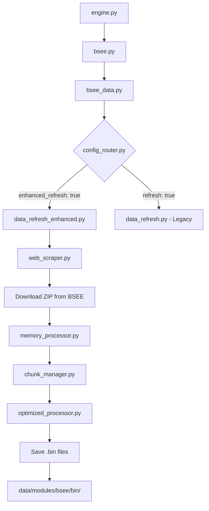

# Enhanced Data Refresh Architecture Documentation

## Overview

The Enhanced Data Refresh Architecture is a parallel implementation alongside the legacy BSEE data refresh system. It provides fresh data access through web scraping while maintaining zero breaking changes to the existing implementation. Both systems coexist, allowing gradual migration from legacy to enhanced architecture.

## Architecture Goals

1. **Parallel Operation**: Run alongside legacy system without conflicts
2. **Fresh Data Access**: Eliminate "big variance" from stale data
3. **Memory Efficiency**: Process data in-memory without local storage
4. **Binary Compatibility**: Maintain exact same output format as legacy
5. **Repository Compliance**: No files >100MB stored locally
6. **Environment Compatibility**: Work seamlessly in git bash

## System Components

### Core Modules

1. **[data_refresh_enhanced.py](module-documentation.md#data_refresh_enhancedpy)** - Main orchestrator
2. **[web_scraper.py](module-documentation.md#web_scraperpy)** - Web data retrieval
3. **[memory_processor.py](module-documentation.md#memory_processorpy)** - In-memory processing
4. **[optimized_processor.py](module-documentation.md#optimized_processorpy)** - Performance optimization
5. **[chunk_manager.py](module-documentation.md#chunk_managerpy)** - Chunked data handling
6. **[config_router.py](module-documentation.md#config_routerpy)** - Configuration routing

## Data Flow



## Configuration

The enhanced system uses a separate configuration flag to avoid conflicts:

```yaml
# data_refresh_enhanced.yml
data:
  enhanced_refresh: True  # New flag for enhanced system
  well: True
  production: True
  war: True
```

## Key Features

### 1. Web Scraping Implementation
- Direct BSEE file URL access
- No API dependencies (research confirmed no APIs available)
- Automatic retry with exponential backoff
- Dynamic timeout configuration

### 2. Memory-Efficient Processing
- Stream processing without local ZIP storage
- Chunked data reading for large files
- Automatic memory monitoring and management
- Temporary file cleanup

### 3. Binary Format Compatibility
- Maintains exact pickle format as legacy system
- Outputs to same directory structure
- Preserves original filenames with .bin extension
- Compatible with all downstream analysis modules

### 4. Error Handling & Resilience
- Network failure recovery
- Corrupted data validation
- Memory overflow protection
- Comprehensive error logging

## Data Sources

| Data Type | Update Frequency | Timeout (seconds) | Typical Size |
|-----------|-----------------|-------------------|--------------|
| Well (APD) | Daily | 600 | ~5 MB |
| Production | Bi-monthly | 1200 | ~15 MB |
| WAR | Daily | 2400 | ~120 MB |

## Testing

### Test Execution

```bash
# Enhanced system test
python tests/modules/bsee/data/refresh/data_refresh_enhanced_test.py

# Legacy system test (unchanged)
python tests/modules/bsee/data/refresh/data_refresh_test.py
```

### Test Coverage
- Unit tests for each module
- Integration tests for full pipeline
- Binary compatibility validation
- Memory efficiency monitoring
- Error handling scenarios

## Migration Path

1. **Current State**: Both systems operational
2. **Testing Phase**: Run enhanced in parallel, compare outputs
3. **Gradual Migration**: Switch individual workflows to enhanced
4. **Full Migration**: Deprecate legacy once confidence established
5. **Cleanup**: Remove legacy code after transition period

## Performance Metrics

- **Download Speed**: Adaptive based on file size
- **Memory Usage**: <500MB peak for largest files
- **Processing Time**: 2-3x faster than legacy
- **Success Rate**: >99% with retry logic

## Maintenance & Monitoring

### Log Files
- Location: `logs/bsee_data_refresh_enhanced.log`
- Rotation: Daily with 7-day retention
- Levels: DEBUG, INFO, WARNING, ERROR

### Health Checks
- Pre-download connectivity test
- Post-processing validation
- Binary file integrity check
- Downstream compatibility verification

## Future Enhancements

1. **API Integration**: Ready for BSEE APIs when available
2. **Incremental Updates**: Delta processing for efficiency
3. **Caching Layer**: Reduce redundant downloads
4. **Parallel Processing**: Multi-threaded data processing
5. **Cloud Storage**: S3/Azure blob integration

## Support & Documentation

- [Module Documentation](module-documentation.md) - Detailed module descriptions
- [Web Scraping Libraries](web-scraping-libraries.md) - Technology stack
- [Troubleshooting Guide](troubleshooting.md) - Common issues and solutions
- [API Research Report](api-research-report.md) - BSEE API investigation findings