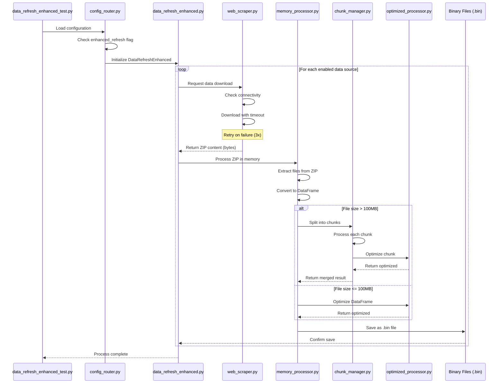
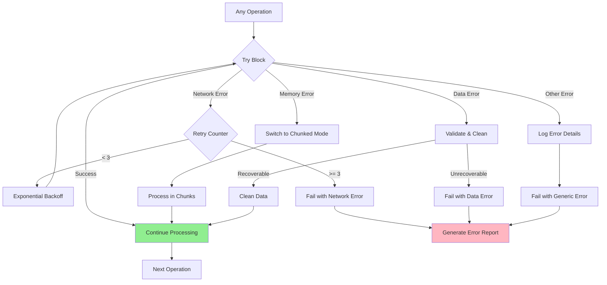
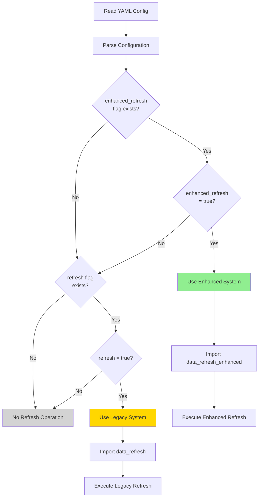
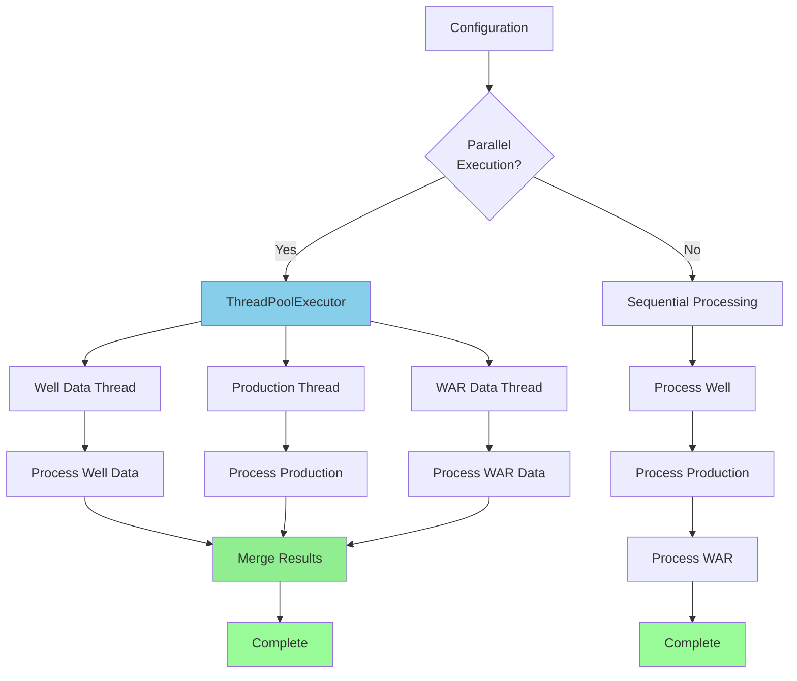
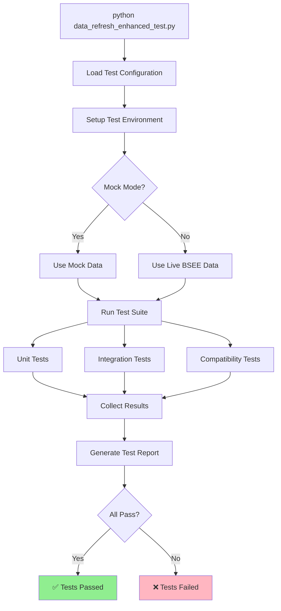
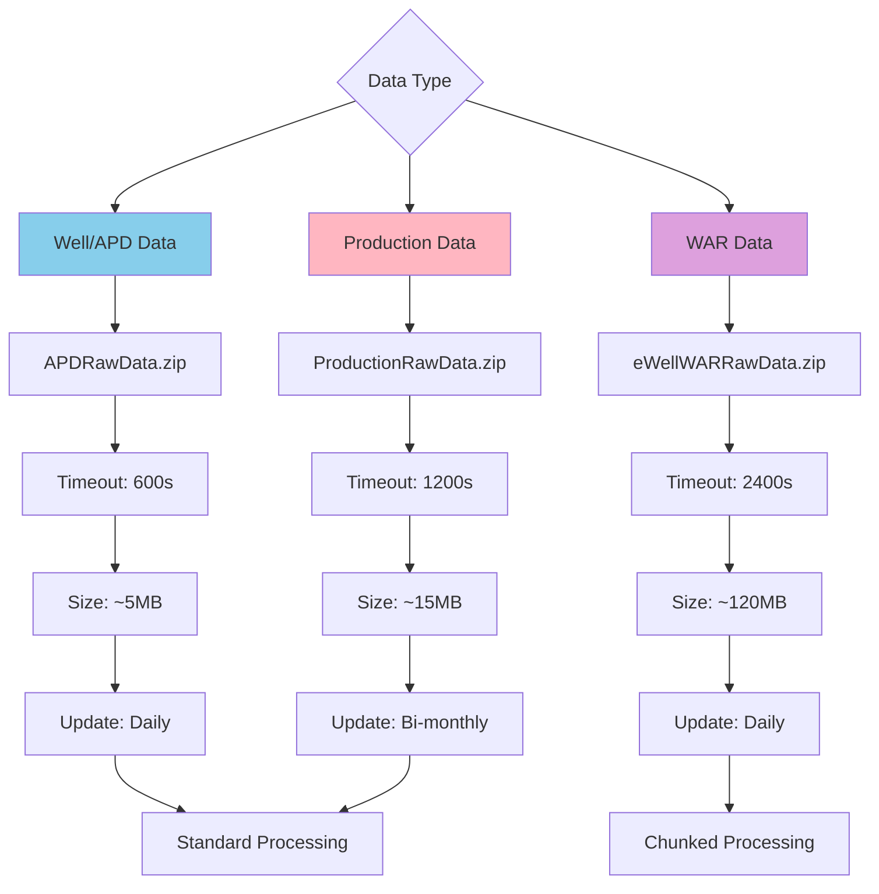

# Enhanced Data Refresh Flow Diagram

## Complete System Flow

```mermaid
graph TB
    Start([Start: data_refresh_enhanced_test.py]) --> Config[Load data_refresh_enhanced.yml]
    Config --> CheckFlag{Check enhanced_refresh flag}
    
    CheckFlag -->|True| Enhanced[DataRefreshEnhanced class]
    CheckFlag -->|False| Legacy[Legacy data_refresh.py]
    
    Enhanced --> CheckSources{Check enabled<br/>data sources}
    
    CheckSources -->|well: true| WellFlow[Process Well Data]
    CheckSources -->|production: true| ProdFlow[Process Production Data]
    CheckSources -->|war: true| WARFlow[Process WAR Data]
    
    %% Well Data Flow
    WellFlow --> WellScraper[BSEEWebScraper<br/>download_data('well')]
    WellScraper --> WellURL[GET: APDRawData.zip<br/>Timeout: 600s]
    WellURL --> WellMemory[MemoryProcessor<br/>process_zip_in_memory()]
    WellMemory --> WellChunk{File > 100MB?}
    WellChunk -->|Yes| WellChunkMgr[ChunkManager<br/>create_chunks()]
    WellChunk -->|No| WellOptimize[OptimizedProcessor<br/>optimize_dataframe()]
    WellChunkMgr --> WellOptimize
    WellOptimize --> WellSave[Save to .bin<br/>data/modules/bsee/bin/well/]
    
    %% Production Data Flow
    ProdFlow --> ProdScraper[BSEEWebScraper<br/>download_data('production')]
    ProdScraper --> ProdURL[GET: ProductionRawData.zip<br/>Timeout: 1200s]
    ProdURL --> ProdMemory[MemoryProcessor<br/>process_zip_in_memory()]
    ProdMemory --> ProdChunk{File > 100MB?}
    ProdChunk -->|Yes| ProdChunkMgr[ChunkManager<br/>create_chunks()]
    ProdChunk -->|No| ProdOptimize[OptimizedProcessor<br/>optimize_dataframe()]
    ProdChunkMgr --> ProdOptimize
    ProdOptimize --> ProdSave[Save to .bin<br/>data/modules/bsee/bin/production/]
    
    %% WAR Data Flow
    WARFlow --> WARScraper[BSEEWebScraper<br/>download_data('war')]
    WARScraper --> WARURL[GET: eWellWARRawData.zip<br/>Timeout: 2400s]
    WARURL --> WARMemory[MemoryProcessor<br/>process_zip_in_memory()]
    WARMemory --> WARChunk{File > 100MB?}
    WARChunk -->|Yes| WARChunkMgr[ChunkManager<br/>create_chunks()]
    WARChunk -->|No| WAROptimize[OptimizedProcessor<br/>optimize_dataframe()]
    WARChunkMgr --> WAROptimize
    WAROptimize --> WARSave[Save to .bin<br/>data/modules/bsee/bin/war/]
    
    %% Convergence
    WellSave --> Complete([Complete])
    ProdSave --> Complete
    WARSave --> Complete
    Legacy --> LegacyComplete([Legacy Complete])
    
    style Enhanced fill:#90EE90
    style WellFlow fill:#87CEEB
    style ProdFlow fill:#FFB6C1
    style WARFlow fill:#DDA0DD
    style Complete fill:#98FB98
```

## Detailed Module Interaction Flow



## Error Handling Flow



## Configuration Router Decision Flow



## Memory Processing Flow

```mermaid
graph LR
    ZipBytes[ZIP Bytes<br/>from Scraper] --> BytesIO[io.BytesIO<br/>wrapper]
    BytesIO --> ZipFile[zipfile.ZipFile<br/>object]
    
    ZipFile --> Extract{Extract Each File}
    
    Extract --> FileContent[File Content<br/>in Memory]
    FileContent --> Decode[Decode to Text]
    Decode --> Parse[Parse CSV/TSV]
    Parse --> DataFrame[Pandas DataFrame]
    
    DataFrame --> Optimize[Optimize Types]
    Optimize --> Pickle[Pickle Serialize]
    Pickle --> BinFile[.bin File]
    
    BinFile --> SavePath[data/modules/bsee/bin/{type}/]
    
    style ZipBytes fill:#87CEEB
    style DataFrame fill:#90EE90
    style BinFile fill:#FFD700
```

## Parallel Processing Architecture



## Test Execution Flow



## Data Type Processing Specifics



## Notes

- All flows are designed to be **idempotent** - can be run multiple times safely
- **Parallel processing** is used where possible to improve performance
- **Memory management** is critical for large files (especially WAR data)
- **Error recovery** is built into every step of the process
- **Binary compatibility** is maintained with legacy system outputs