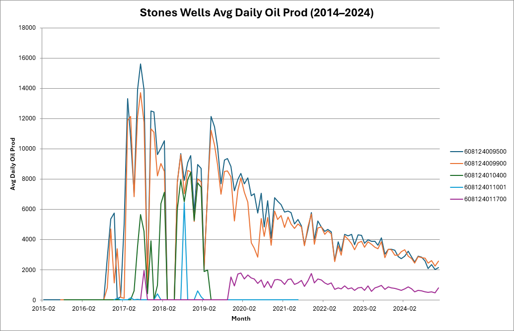

## Objective

## SME, Roy

Need the following well data

### Summary

- [ ] Identify and combine data sources, see data sources below
- [ ] Utilize the well data function "prepare_field_well_data", etc., in src\energydata\modules\bsee\analysis\bsee_analysis.py

| Data | Description | Source/Method
| --- | --- | --- |
Well Name |  | Well Name, by_block_well_data
Water Depth | | Water Depth (feet), by_block_well_data
Spud Date | | WELL_SPUD_DATE, APIRawData_mv_api_list_all
Rig Name  | | Rig Name, by_block_well_data
Rig Start Date |  | by_block_well_data
Rig Release Date | | calculated from by_block_well_data (last date)
TVD | | WELL_BORE_TVD, BoreholeRawData
TMD | | BH_TOTAL_MD, APIRawData_mv_api_list_all
TD Date | | TOTAL_DEPTH_DATE, APIRawData_mv_api_list_all
Number of sidetracks | | caculated
Well departure (step out) |  | caculated from well bore data, dsptsdelimit
Mud Weight at TD (max) | | 
Drilling Days | | calculated
Completion Days | | calculated
First oil date  | | calculated from production data
Production rate by month | by API | from yearly zip files, [#23](https://github.com/vamseeachanta/energydata/issues/23)

### Data Sources

by_block_well_data :  tests\modules\bsee\analysis\results\Data\julia_by_block\WR540.csv

BHPS: https://github.com/vamseeachanta/energydata/blob/2084250f6055a4f0dae7cafc3844f797bc8b624d/tests/modules/bsee/data/results/Data/by_zip/BHPSRawData_mv_bhpsurvey_all.csv

APIRawData_mv_api_list_all : https://github.com/vamseeachanta/energydata/blob/2084250f6055a4f0dae7cafc3844f797bc8b624d/tests/modules/bsee/data/results/Data/by_zip/APIRawData_mv_api_list_all.csv

BoreholeRawData: https://github.com/vamseeachanta/energydata/blob/1691a05e908c4a69876d821296e63e5e65277a73/tests/modules/bsee/data/results/Data/by_zip/BoreholeRawData_mv_boreholes_all.csv

dsptsdelimit: https://github.com/vamseeachanta/energydata/blob/2084250f6055a4f0dae7cafc3844f797bc8b624d/tests/modules/bsee/data/results/Data/by_zip/dsptsdelimit.csv

## PRoduction Data

  - [ ] https://www.data.bsee.gov/Main/Production.aspx, See OGOR-A (1996-Current) , OGOR-B (1996-Current), OGOR-C (1996-Current) 
  - [ ] https://www.data.bsee.gov/Main/OGOR-A.aspx
  - [ ] https://www.data.bsee.gov/Production/Files/ogoradelimit.zip
  - [ ] https://www.data.bsee.gov/Production/Files/ogora2023delimit.zip
  - [ ] https://www.data.bsee.gov/Production/Files/ogora2022delimit.zip
  - [ ] https://www.data.bsee.gov/Production/Files/ogora2021delimit.zip
  - [ ] ...
  - [ ] ...
  - [ ] https://www.data.bsee.gov/Production/Files/ogora1966delimit.zip
- [ ] TBA

## Economics

https://www.linkedin.com/company/analytics-energy/posts/

### Communications

#### 2025-04-25 Roy - Shell APIs

Great stuff guys!  We are cooking with oil and gas now!! 😊  Let me work through some of this this weekend and I will get back to you.

Shell’s Stones ultra-deepwater development consists of eight subsea production wells in total—two first-phase wells tied back in September 2016, followed by six more in late 2017 Home. As of the end of 2017, all eight wells were onstream and producing.

Shell’s Stones ultra-deepwater development comprises eight subsea production wells in total (all of which are onstream) WVDEP. From the OGOR-A data you provided for Lease G17001, we have production records for six of those wells, with these APIs:

608124009500
608124009900
608124010400
608124011001
608124011700
608124010800

The remaining two development wells (completing the eight-well program) aren’t represented in your G17001 extract, likely because they lie on a different bottom lease. If you need to pull their APIs you’ll want the OGOR-A export for that lease (WR 551 – OCS-G 21861), or lease-level production data from BSEE.

I would say that Stones subsea is an abysmal failure.  Can you believe these people can’t figure out they need direct vertical access to the completion!  8 producers completed, 5 still producing.

#### 2025-04-24 Roy

Looking good Vamsee.  Here are some plots and tables I created so far for St Malo.  I will get you some more feedback tomorrow.

| Well API         | Peak Date | Peak Value (STB/day) | Last Date | Last Value (STB/day) | Years | Annual Decline Rate | Annual Decline (%) |
|------------------|-----------|-----------------------|-----------|-----------------------|--------|----------------------|---------------------|
| 608124009400     | 42613     | 11244                | 45688     | 2552                 | 8      | 0.16                 | 16                  |
| 608124003301     | 44165     | 6895                 | 45688     | 2860                 | 4      | 0.19                 | 19                  |
| 608124010800     | 43524     | 13339                | 45688     | 9192                 | 6      | 0.06                 | 6                   |
| 608124012701     | 44316     | 34088                | 45688     | 6685                 | 4      | 0.35                 | 35                  |
| 608124005600     | 41152     | 46451                | 45716     | 1663                 | 13     | 0.23                 | 23                  |
| 608124005700     | 42460     | 15562                | 45716     | 4902                 | 9      | 0.12                 | 12                  |
| 608124005400     | 43281     | 14738                | 45716     | 5553                 | 7      | 0.14                 | 14                  |
| 608124005800     | 43434     | 16107                | 45716     | 7822                 | 6      | 0.11                 | 11                  |
| 608124011400     | 43343     | 19009                | 45716     | 8050                 | 7      | 0.12                 | 12                  |
| 608124011801     | 43312     | 10636                | 45716     | 4009                 | 7      | 0.14                 | 14                  |
| 608124012200     | 43373     | 12452                | 45716     | 4741                 | 6      | 0.14                 | 14                  |
| 608124013202     | 44286     | 11415                | 45716     | 3470                 | 4      | 0.26                 | 26                  |
| 608124013600     | 44469     | 12620                | 45716     | 5473                 | 3      | 0.22                 | 22                  |
| 608124005000     | 42155     | 12357                | 45716     | 3564                 | 10     | 0.12                 | 12                  |
| 608124005103     | 42794     | 16865                | 45716     | 6854                 | 8      | 0.11                 | 11                  |
| 608124001701     | 41305     | 76878                | 45716     | 3473                 | 12     | 0.23                 | 23                  |
| 608124005203     | 42855     | 7325                 | 43890     | 650                  | 3      | 0.57                 | 58                  |
| 608124011504     | 43708     | 13871                | 45716     | 6649                 | 6      | 0.13                 | 13                  |
| 608124011606     | 43585     | 11560                | 45716     | 2999                 | 6      | 0.21                 | 21                  |
| 608124012601     | 43769     | 4480                 | 45351     | 562                  | 4      | 0.38                 | 38                  |
| 608124014600     | 45322     | 6622                 | 45716     | 4359                 | 1      | 0.32                 | 32                  |
| 608044022300     | 38199     | 375                  | 38230     | 272                  | 0      | 0.98                 | 98                  |
| 608044022301     | 38352     | 326                  | 38564     | 150                  | 1      | 0.74                 | 74                  |
| 608124012500     | 44043     | 10162                | 45716     | 3379                 | 5      | 0.21                 | 21                  |

According to Chevron’s publicly-available development profiles:

Number of production wells:
- Initial build-out (Stages 1–2): 10 production wells drilled (4 at Jack, 6 at St. Malo) Offshore Technology
- Stage 3 (May 2020): +2 production wells at Jack (total Jack = 6) Offshore Technology
- Stage 4 waterflood (announced 2019): +2 production wells at St. Malo (total St. Malo = 8) chevron.com
- — Grand total: 14 production wells on the Jack/St. Malo facility.
- Cumulative oil (and gas-oil equivalent) produced:
   - Since first-oil in December 2014, Jack and St. Malo together have yielded almost 400 million gross barrels of oil-equivalent  through mid-2024
 

Using the average‐daily rates multiplied by the exact days in each month (2014 to the latest), the total oil volume produced across all wells is 428,760,422 STB. 

| Year | Total Oil (STB) | Avg Price (USD/bbl) | Revenue (USD)     |
|------|------------------|----------------------|--------------------|
| 2014 | 15,184           | 93.17                | $1,414,730         |
| 2015 | 446,720          | 48.66                | $21,737,388        |
| 2016 | 663,495          | 43.29                | $28,722,696        |
| 2017 | 842,863          | 50.80                | $42,817,464        |
| 2018 | 801,457          | 65.23                | $52,279,064        |
| 2019 | 724,099          | 56.99                | $41,266,401        |
| 2020 | 572,747          | 39.68                | $22,726,615        |
| 2021 | 471,324          | 68.17                | $32,130,132        |
| 2022 | 425,214          | 94.53                | $40,195,502        |
| 2023 | 369,337          | 77.64                | $28,675,300        |
| 2024 | 440,424          | 75.83                | $33,397,315        |
| 2025 | 70,196           | 69.97                | $4,911,595         |
|      |                  |                      |                    |
|      |                  |                      | **$350,274,201**   |

Ok now we got it straighted out! 

| Year | Total Oil (STB)   | Avg Price (USD/bbl) | Revenue (USD)        |
|------|--------------------|----------------------|------------------------|
| 2014 | 592,844            | $93.17               | $55,235,238            |
| 2015 | 20,269,835         | $48.66               | $986,330,182           |
| 2016 | 32,738,007         | $43.29               | $1,417,228,321         |
| 2017 | 41,161,313         | $50.80               | $2,090,994,705         |
| 2018 | 48,724,850         | $65.23               | $3,178,321,981         |
| 2019 | 53,224,972         | $56.99               | $3,033,291,142         |
| 2020 | 48,338,735         | $39.68               | $1,918,080,995         |
| 2021 | 48,264,826         | $68.17               | $3,290,213,190         |
| 2022 | 46,313,051         | $94.53               | $4,377,972,713         |
| 2023 | 41,583,481         | $77.64               | $3,228,541,451         |
| 2024 | 38,264,343         | $75.83               | $2,901,585,153         |
| 2025 | 5,316,123          | $69.97               | $371,969,145           |
|      | **424,792,380**    | **$65.33**           | **$26,849,764,217**    |

### 2025-03-25 Chuck's NPV Calculations

Guys, I’ve gone back to the data we (Roy & Vamsee) gathered for our WORLD OIL articles in 2020-21 to see if JSM might actually be a commercially viable project since it has produced so much oil compared to the other HPHT Wilcox discoveries. It is clearly the closest any HPHT WILCOX field has come to being a star performer.

So, see the attached… and, let me know if you think that with Phase IV, JSM will ever actually become a net positive investment for CVX and their partners. Of course, if one has completely written of the lengthy/expensive E&A program, perhaps it can come close.

Here’s a summary of things I’ve highlighted in the attached:

As of the end of this record mid-2019, JSM had produced ~174Mbbls
CVX website claims that JSM had produced ~400MBOE by Sept. 2024!
So, they were able to add over 200MBOE in the next 5yrs (2019-24)… so, several new wells and more CAPEX were involved as the older wells depleted (or failed).
Press release in Sept. 2019 reported that Ph. 4 would add 175Mbbls
I think it was expected to cost $2B, but I don’t remember where I saw that???
There are 15 wells listed, but I’ve highlighted production starts for 19 completions
Four of the 19 are either simple recompletion re-starts or full sidetracks on JACK which has only 6 wells listed but 10 “completions”
One JACK well (WR759 PS001) started production in 2014 and failed within 1 month… it was “recompleted”(?) in 2017 but never produced much oil.
9 producers drilled in St. Malo (which lies in <2,200ft WD)… AND, none of them seem to have had any production problems through 2019.
Well WR678 PS002 was the last one completed on St. Malo (in Ph. 3) and has been a great producer – averaging 16,559bopd for the time it was producing with at peak of 19,000bopd!
If we make assumptions about facility, infrastructure, and well/completion costs per the table I’ve inserted in the first 2 columns (starting on row 36 and copy pasted just below), we estimate a CAPEX investment of $10B through PH. III with a negative NPV(8%) of -$9.723.
The 2015 EIA report on deepwater field development cites JSM investment plan at $12B.
The NPV of oil sales from JSM for this period is ~$6B.
So, net NPV(8%) is negative at ~$3.7B and close to -$6B if CAPEX was actually $12B! (slightly worse for 10% discount factor)
Of course, ~$2B cost of E&A is ignored as already written off.

https://github.com/vamseeachanta/energydata/blob/202502/docs/modules/bsee/JStM-WELL-Production-Data-thru-2019.xlsx

#### 2025-02-11

Roy, 

Short answer: We are already using AI to download data. AI still needs immense human intelligence especially for BSEE Data download.

Will respond this morning with details in our dedicated thread limited audience thread. 

Vamsee

On Wed, Feb 12, 2025 at 6:59 AM <roy.shilling@frontierdeepwater.com> wrote:
Vamsee is it possible to just download all the data associated with Julia into multiple files.  We may be able to feed those into ai and get faster processing rather than trying to generate more complicated python scripts?

r

From: Vamsee Achanta <vamsee.achanta@aceengineer.com>
Sent: Tuesday, February 11, 2025 9:00 PM
To: roy.shilling@frontierdeepwater.com
Cc: chuck.white@frontierdeepwater.com; terrance.ivers@gmail.com; Howard Day <howardday7777@gmail.com>; paul.hyatt@tdsolutions.com.au
Subject: Re: Average DAILY OIL PRODUCTION data for WILCOX fields

Yes, I (and my assistant programmer, Samdan) are working on Julia first. 

Will get some preliminary answers on well count tomorrow.
