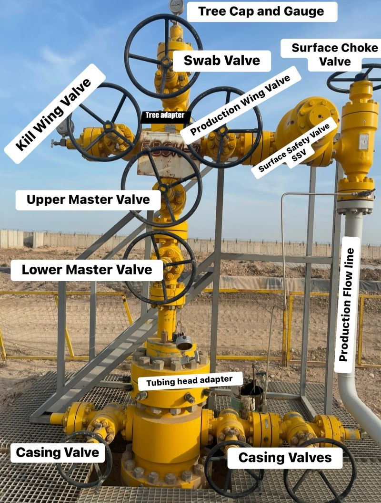

X-Mass Tree

The Christmas tree is used to control the flow of oil or gas from the well and to regulate the pressure of the reservoir. It is named after its shape, which resembles a Christmas tree when fully assembled. The Christmas tree is an essential component of the wellhead system, and it plays a vital role in the production of oil and gas.

There are two types of Christmas trees used in the oil and gas industry: the surface Christmas tree and the subsea Christmas tree. The surface Christmas tree is installed on the wellhead above ground, while the subsea Christmas tree is installed on the seabed. The subsea Christmas tree is used in deepwater drilling, where the wellhead is located on the seafloor. 

The components of a Christmas tree include valves, chokes, gauges, and actuators, among others. The valves are used to control the flow of oil or gas from the well, while the chokes are used to regulate the pressure of the reservoir. The gauges are used to monitor the pressure and temperature of the well, while the actuators are used to control the valves and chokes remotely. Overall, the Christmas tree is a critical component of the oil and gas industry, and it is necessary for the safe and efficient production of hydrocarbons.

