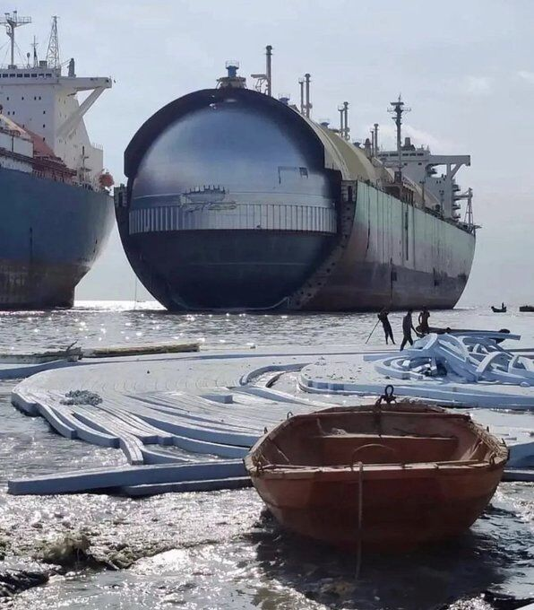

This is what an LNG tanker looks like beneath the outer hull. The domes you see above deck are spherical tanks inside the ship, containing the cryogenic cargo. These Moss Rosenberg tanks are self-supporting spheres connected at the equator to a cylindrical skirt welded into the hull. 

Built from aluminium alloy or 9% nickel steel, they can exceed 40 m in diameter with shell thicknesses up to 50 mm. Insulation, usually polyurethane or similar foams, is fitted over the tank and upper skirt.

Unlike membrane systems, Moss tanks don?t have a full secondary barrier. 

They rely on the integrity of the sphere itself, with drip trays and a partial barrier below the equator to catch any leakage.

The spherical form reduces surface area for a given volume, limiting heat ingress and LNG boil-off, and virtually eliminates sloshing when full.

The drawback is space efficiency: spheres waste hull volume, which is why most new LNG carriers use prismatic or membrane systems.

The choice of containment system ultimately depends on project needs: balancing safety, space, and budget. Moss tanks remain valued for their robustness and safety philosophy, though prismatic and membrane designs offer superior space utilisation and full secondary containment.

-
?? I often post on engineering, infrastructure and industry. If that is your thing, follow me for more. 

I never use AI footage. 
?? Cool Merchant Mariners (a 28-year-old small-scale Moss-type vessel is next up for the breakers)

