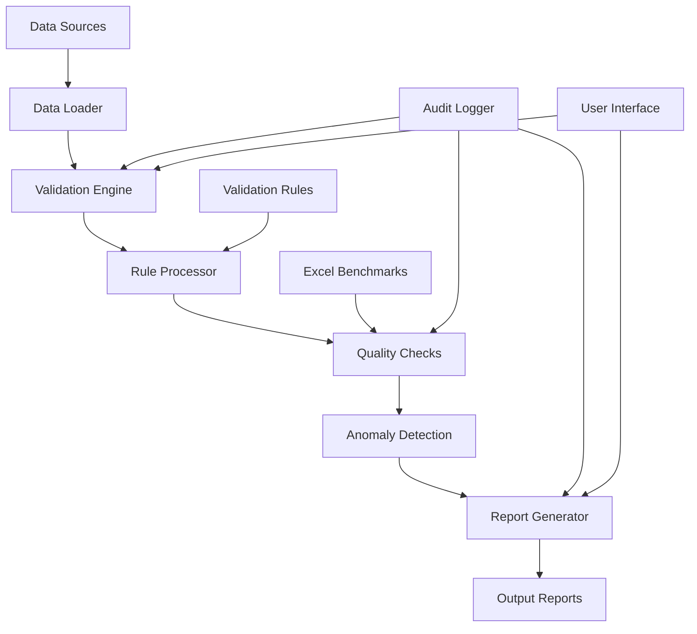

# Spec Requirements Document

> Spec: Well Data Verification System
> Created: 2025-01-13
> Status: Planning
> Module: Analysis
> Template: WorldEnergyData

## Executive Summary

This spec implements a comprehensive well data verification system that provides systematic workflows for validating production data accuracy, ensuring data quality standards, and identifying anomalies before analysis and reporting. The system will enable manual verification workflows, automated quality checks, and complete audit trails for regulatory compliance, significantly improving data reliability and reducing analysis errors.

## User Prompt

> This spec was initiated based on the following user request:

```
Implement a comprehensive well data verification system that provides systematic workflows for validating production data accuracy, ensuring data quality, and identifying anomalies before analysis and reporting.
```

## Overview

Implement a comprehensive well data verification system that provides systematic workflows for validating production data accuracy, ensuring data quality, and identifying anomalies before analysis and reporting.

## User Stories

### Manual Data Verification Workflow

As a **Data Analyst**, I want to manually verify well production data through a systematic workflow, so that I can ensure data accuracy before analysis and identify any anomalies or issues.

The workflow should guide me through:
1. Loading well data from BSEE sources
2. Validating production volumes against expected ranges
3. Checking for data completeness (missing months, zero values)
4. Verifying oil prices and economic calculations
5. Cross-referencing with Excel benchmarks
6. Documenting discrepancies and findings
7. Generating verification reports

### Data Quality Monitoring

As a **Quality Assurance Engineer**, I want automated checks and alerts for data quality issues, so that I can maintain high data integrity and catch problems early.

The system should monitor:
1. Data freshness and update frequency
2. Outlier detection in production values
3. Consistency checks across data sources
4. Validation against business rules
5. Automated reporting of issues
6. Historical quality trend tracking

### Verification Audit Trail

As a **Compliance Officer**, I want complete audit trails of all verification activities, so that I can demonstrate data governance and regulatory compliance.

The system should provide:
1. Timestamped verification logs
2. User activity tracking
3. Change history for corrections
4. Verification status reporting
5. Compliance documentation generation

## Spec Scope

1. **Verification Workflow Engine** - Structured process for step-by-step well data validation with checkpoints and documentation
2. **Data Quality Framework** - Automated validation rules, outlier detection, and completeness checks for well production data
3. **Validation Rules Library** - Configurable business rules for data validation with YAML-based definitions
4. **Cross-Reference Module** - Excel benchmark comparison and discrepancy reporting
5. **Audit and Logging System** - Complete tracking of verification activities and data lineage

## Out of Scope

- Dashboard visualization (separate spec)
- Real-time streaming data validation
- Machine learning predictive models
- Mobile application development
- Integration with proprietary third-party systems

## Expected Deliverable

1. Python-based verification workflow tool that guides users through data validation steps
2. Command-line interface for executing verification workflows
3. YAML-based validation rule configuration system
4. Comprehensive verification reports in PDF and Excel formats
5. Complete audit trail and compliance documentation

## Technical Architecture



## Implementation Methodology: WorldEnergyData Approach

### Overview
This implementation leverages the WorldEnergyData repository's established patterns for data validation and quality assurance, extending them with comprehensive verification workflows.

### Key Methodology Components

#### Verification Strategy
- **WorldEnergyData Method**: Modular validation pipeline with configurable rules
- **Benefit**: Flexible, extensible validation framework adaptable to various data sources

#### Quality Assurance Architecture
- **WorldEnergyData Method**: Layered validation with progressive refinement
- **Benefit**: Catches issues at multiple stages, improving overall data quality

#### Audit Trail Implementation
- **WorldEnergyData Method**: Comprehensive logging with immutable audit records
- **Benefit**: Complete traceability for compliance and debugging

### Why WorldEnergyData Method?

1. **Proven Patterns**: Leverages existing data processing infrastructure
2. **Scalability**: Handles large datasets efficiently through optimized validation
3. **Maintainability**: Modular design allows easy updates and extensions
4. **Integration**: Seamlessly works with existing BSEE data modules
5. **Compliance Ready**: Built-in audit trails meet regulatory requirements

## Performance Requirements

- Process 1000+ wells in under 30 seconds
- Generate verification reports with minimal memory footprint
- Support concurrent validation of multiple datasets
- Real-time anomaly detection during data ingestion
- Sub-second response time for validation rule evaluation

## Spec Documentation

- Prompt Evolution: @specs/modules/analysis/well-data-verification/prompt.md
- Tasks: @specs/modules/analysis/well-data-verification/tasks.md
- Technical Specification: @specs/modules/analysis/well-data-verification/sub-specs/technical-spec.md
- API Specification: @specs/modules/analysis/well-data-verification/sub-specs/api-spec.md
- Database Schema: @specs/modules/analysis/well-data-verification/sub-specs/database-schema.md
- Tests Specification: @specs/modules/analysis/well-data-verification/sub-specs/tests.md
- Task Summary: @specs/modules/analysis/well-data-verification/task_summary.md