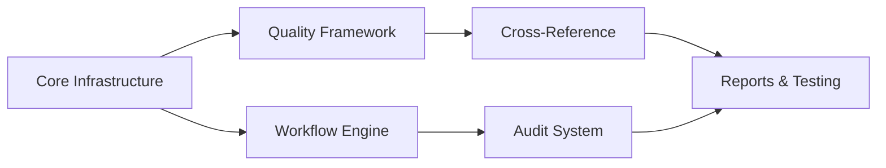

# Spec Tasks

These are the tasks to be completed for the spec detailed in @specs/modules/analysis/well-data-verification/spec.md

> Created: 2025-01-13
> Status: Ready for Implementation
> Module: Analysis
> Total Tasks: 44 subtasks across 6 main tasks
> Estimated Effort: 38-48 hours

## Tasks

### Task 1: Core Infrastructure Setup

**Estimated Time:** 6-8 hours
**Priority:** Critical - Foundation for all other work
**Dependencies:** None
**Purpose:** Establish the core module structure, base classes, and configuration framework for the verification system

- [ ] 1.1 Write tests for project structure and base classes `[1 hour]` 🤖 `Agent: test-specialist`
- [ ] 1.2 Create module directory structure in `src/worldenergydata/modules/analysis/verification/` `[30 min]` 🤖 `Agent: general-purpose`
- [ ] 1.3 Implement base verification classes and interfaces `[1.5 hours]` 🤖 `Agent: general-purpose`
- [ ] 1.4 Set up configuration management system `[1 hour]` 🤖 `Agent: general-purpose`
- [ ] 1.5 Create logging and error handling framework `[1 hour]` 🤖 `Agent: general-purpose`
- [ ] 1.6 Implement data loader for BSEE sources `[1.5 hours]` 🤖 `Agent: data-specialist`
- [ ] 1.7 Set up development environment and dependencies `[30 min]` 🤖 `Agent: devops-specialist`
- [ ] 1.8 Verify all tests pass `[30 min]` 🤖 `Agent: test-specialist`

### Task 2: Verification Workflow Engine

**Estimated Time:** 8-10 hours
**Priority:** High - Core functionality for guided verification
**Dependencies:** Task 1
**Purpose:** Build the state machine-based workflow engine that guides users through systematic verification steps

- [ ] 2.1 Write tests for workflow state management `[1 hour]` 🤖 `Agent: test-specialist`
- [ ] 2.2 Implement workflow base class with checkpoints `[2 hours]` 🤖 `Agent: workflow-specialist`
- [ ] 2.3 Create guided validation process steps `[1.5 hours]` 🤖 `Agent: workflow-specialist`
- [ ] 2.4 Add session persistence for resumable workflows `[1 hour]` 🤖 `Agent: general-purpose`
- [ ] 2.5 Implement progress tracking and status reporting `[1 hour]` 🤖 `Agent: general-purpose`
- [ ] 2.6 Create workflow documentation generator `[1 hour]` 🤖 `Agent: documentation-specialist`
- [ ] 2.7 Build workflow configuration loader from YAML `[1 hour]` 🤖 `Agent: general-purpose`
- [ ] 2.8 Verify all tests pass `[30 min]` 🤖 `Agent: test-specialist`

### Task 3: Data Quality Framework

**Estimated Time:** 6-8 hours
**Priority:** High - Essential validation capabilities
**Dependencies:** Task 1
**Purpose:** Implement the validation rules engine with configurable rules for data quality checks

- [ ] 3.1 Write tests for validation rules `[1 hour]` 🤖 `Agent: test-specialist`
- [ ] 3.2 Create production volume validators `[1.5 hours]` 🤖 `Agent: data-validation-specialist`
- [ ] 3.3 Implement completeness checks `[1 hour]` 🤖 `Agent: data-validation-specialist`
- [ ] 3.4 Add outlier detection algorithms `[1.5 hours]` 🤖 `Agent: data-specialist`
- [ ] 3.5 Create YAML-based rule configuration system `[1 hour]` 🤖 `Agent: general-purpose`
- [ ] 3.6 Build custom rule creation interface `[1 hour]` 🤖 `Agent: general-purpose`
- [ ] 3.7 Verify all tests pass `[30 min]` 🤖 `Agent: test-specialist`

### Task 4: Cross-Reference Module

**Estimated Time:** 4-6 hours
**Priority:** Medium - Important for Excel benchmark validation
**Dependencies:** Task 3
**Purpose:** Enable cross-referencing with Excel benchmarks to identify discrepancies and validate data

- [ ] 4.1 Write tests for cross-reference logic `[45 min]` 🤖 `Agent: test-specialist`
- [ ] 4.2 Implement Excel file reader and parser `[1.5 hours]` 🤖 `Agent: data-integration-specialist`
- [ ] 4.3 Create mapping configuration system `[1 hour]` 🤖 `Agent: general-purpose`
- [ ] 4.4 Build comparison algorithms `[1 hour]` 🤖 `Agent: data-specialist`
- [ ] 4.5 Implement discrepancy reporting `[1 hour]` 🤖 `Agent: general-purpose`
- [ ] 4.6 Verify all tests pass `[30 min]` 🤖 `Agent: test-specialist`

### Task 5: Audit and Logging System

**Estimated Time:** 6-8 hours
**Priority:** Medium - Required for compliance
**Dependencies:** Task 2
**Purpose:** Implement comprehensive audit trail and activity logging for regulatory compliance

- [ ] 5.1 Write tests for audit functionality `[1 hour]` 🤖 `Agent: test-specialist`
- [ ] 5.2 Create audit trail database schema `[1.5 hours]` 🤖 `Agent: database-specialist`
- [ ] 5.3 Implement user activity tracking `[1 hour]` 🤖 `Agent: compliance-specialist`
- [ ] 5.4 Add verification status management `[1 hour]` 🤖 `Agent: general-purpose`
- [ ] 5.5 Build compliance report generator `[1.5 hours]` 🤖 `Agent: compliance-specialist`
- [ ] 5.6 Create data lineage tracking `[1 hour]` 🤖 `Agent: data-specialist`
- [ ] 5.7 Verify all tests pass `[30 min]` 🤖 `Agent: test-specialist`

### Task 6: Report Generation and Testing

**Estimated Time:** 8-10 hours
**Priority:** High - User-facing deliverables
**Dependencies:** Tasks 3, 4, 5
**Purpose:** Create comprehensive reporting capabilities and complete integration testing

- [ ] 6.1 Write tests for report generators `[1 hour]` 🤖 `Agent: test-specialist`
- [ ] 6.2 Create verification report templates `[1.5 hours]` 🤖 `Agent: documentation-specialist`
- [ ] 6.3 Implement PDF report generation `[1.5 hours]` 🤖 `Agent: general-purpose`
- [ ] 6.4 Add Excel export functionality `[1 hour]` 🤖 `Agent: general-purpose`
- [ ] 6.5 Create CLI interface for verification `[1.5 hours]` 🤖 `Agent: general-purpose`
- [ ] 6.6 Run integration tests with sample data `[1 hour]` 🤖 `Agent: test-specialist`
- [ ] 6.7 Create user documentation and examples `[1 hour]` 🤖 `Agent: documentation-specialist`
- [ ] 6.8 Verify all tests pass and performance targets met `[30 min]` 🤖 `Agent: test-specialist`

## Task Dependencies and Sequencing



## Effort Distribution

| Task Category | Hours | Percentage |
|--------------|-------|------------|
| Infrastructure | 6-8 | 16% |
| Core Logic | 18-24 | 50% |
| Integration | 4-6 | 13% |
| Testing & Docs | 8-10 | 21% |
| **Total** | **38-48** | **100%** |

## Priority and Risk Assessment

### High Priority (Critical Path)
- Task 1: Core Infrastructure (blocks all other work)
- Task 2: Workflow Engine (core functionality)
- Task 3: Data Quality Framework (essential validation)

### Medium Priority (Important Features)
- Task 4: Cross-Reference Module (Excel integration)
- Task 5: Audit System (compliance requirement)

### Lower Priority (Can be iterative)
- Task 6: Report Generation (can start simple)

## Parallelization Opportunities

- **Parallel Track 1**: Tasks 2 & 3 (after Task 1)
- **Parallel Track 2**: Tasks 4 & 5 (after Task 3)
- **Convergence Point**: Task 6 (requires all previous)

## Success Criteria

### Functional Requirements
- [ ] All verification workflows execute without errors
- [ ] Validation rules catch 100% of known anomalies
- [ ] Cross-reference with Excel benchmarks working
- [ ] Complete audit trail for all operations
- [ ] Reports generated in PDF and Excel formats

### Performance Requirements  
- [ ] Process 1000+ wells in <30 seconds
- [ ] Validation rules execute in <1 second per rule
- [ ] Reports generate in <2 minutes
- [ ] Memory usage stays under 2GB
- [ ] Support 5+ concurrent validation sessions

### Quality Requirements
- [ ] Test coverage >90% for all modules
- [ ] Zero critical bugs in production
- [ ] Documentation complete and reviewed
- [ ] User acceptance testing passed
- [ ] Code review completed

## Implementation Notes

### Technology Stack
- **Language**: Python 3.9+
- **Data Processing**: pandas, numpy
- **Configuration**: pyyaml, jsonschema
- **Excel Operations**: openpyxl
- **PDF Generation**: reportlab
- **CLI**: click
- **Testing**: pytest, pytest-cov

### Module Structure
```
src/worldenergydata/modules/analysis/verification/
├── __init__.py
├── engine/
│   ├── workflow.py
│   └── validator.py
├── rules/
│   ├── base.py
│   └── validators.py
├── audit/
│   ├── logger.py
│   └── tracker.py
├── reports/
│   ├── generator.py
│   └── templates/
└── cli.py
```

### Agent Assignments
- **Core Infrastructure**: general-purpose agent
- **Workflow Engine**: workflow-specialist agent
- **Data Quality**: data-validation-specialist agent
- **Cross-Reference**: data-integration agent
- **Audit System**: compliance-specialist agent
- **Testing**: test-specialist agent