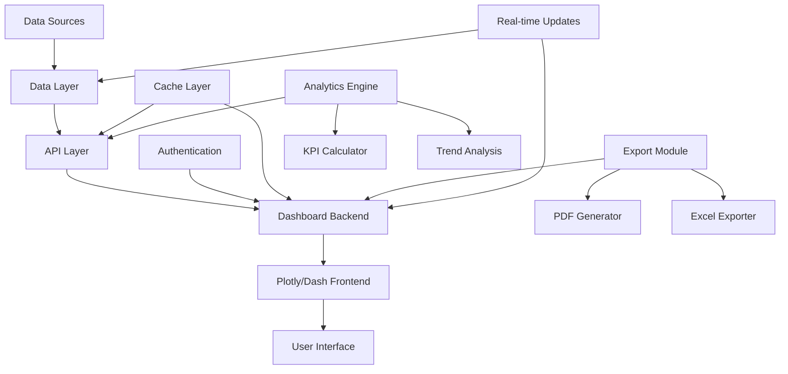

# Spec Requirements Document

> Spec: Well Production Dashboard
> Created: 2025-01-13
> Status: Planning
> Module: Analysis
> Template: WorldEnergyData

## Executive Summary

This spec implements an interactive web-based dashboard for visualizing and analyzing well production data, economic metrics, and operational performance. The dashboard will provide real-time data visualization, field-level aggregations, comparative analysis capabilities, and comprehensive reporting features, enabling energy professionals to make data-driven decisions efficiently and effectively.

## User Prompt

> This spec was initiated based on the following user request:

```
Create an interactive web-based dashboard for visualizing and analyzing well production data, economic metrics, and operational performance with real-time updates and comprehensive reporting capabilities.
```

## Overview

Create an interactive web-based dashboard for visualizing and analyzing well production data, economic metrics, and operational performance with real-time updates and comprehensive reporting capabilities.

## User Stories

### Interactive Well Dashboard

As an **Energy Professional**, I want to access an interactive dashboard showing well performance metrics, so that I can quickly assess production trends, economics, and make data-driven decisions.

The dashboard should provide:
1. Individual well production profiles
2. Field-level aggregated views
3. Economic metrics (NPV, revenue, OPEX)
4. Time-series visualizations
5. Comparative analysis capabilities
6. Export functionality for reports
7. Real-time data refresh capabilities

### Field Performance Analysis

As a **Field Manager**, I want to compare performance across multiple wells and fields, so that I can identify optimization opportunities and allocate resources effectively.

The system should enable:
1. Multi-well comparison charts
2. Field-level KPI dashboards
3. Production decline analysis
4. Economic ranking tables
5. Performance benchmarking
6. Trend identification tools

### Executive Reporting Dashboard

As an **Executive**, I want high-level summaries and key metrics at a glance, so that I can make strategic decisions and communicate performance to stakeholders.

The dashboard should display:
1. Portfolio overview metrics
2. Revenue and cost summaries
3. Production forecasts vs actuals
4. Key performance indicators
5. Customizable executive views
6. Automated report scheduling

## Spec Scope

1. **Dashboard Infrastructure** - Web-based Plotly/Dash application with responsive design and authentication
2. **Well Detail Views** - Individual well pages with production charts, economic metrics, and operational data
3. **Field Aggregation Module** - Field-level rollups, comparisons, and performance analytics
4. **Interactive Visualization Components** - Configurable charts, filters, and data exploration tools
5. **Export and Integration Module** - PDF/Excel export, API endpoints, and data sharing capabilities

## Out of Scope

- Data verification workflows (separate spec)
- Real-time streaming data ingestion
- Mobile native applications
- Advanced predictive analytics
- Third-party system integrations
- Data collection and ETL processes

## Expected Deliverable

1. Web-based dashboard application accessible via browser
2. Interactive visualization components using Plotly
3. RESTful API for dashboard data access
4. Export functionality for charts and reports
5. User authentication and role-based access control

## Technical Architecture



## Implementation Methodology: WorldEnergyData Approach

### Overview
This implementation leverages the WorldEnergyData repository's visualization patterns and extends them with interactive dashboard capabilities using modern web technologies.

### Key Methodology Components

#### Dashboard Architecture
- **WorldEnergyData Method**: Plotly/Dash framework with modular components
- **Benefit**: Rapid development, interactive visualizations, Python-based full stack

#### Data Processing Pipeline
- **WorldEnergyData Method**: Efficient pandas-based aggregation with caching
- **Benefit**: Real-time performance even with large datasets

#### Visualization Strategy
- **WorldEnergyData Method**: Component-based architecture with reusable charts
- **Benefit**: Consistent UI/UX, maintainable codebase, responsive design

### Why WorldEnergyData Method?

1. **Proven Visualization Patterns**: Leverages existing chart components
2. **Performance Optimized**: Built-in caching and efficient data queries
3. **Scalable Architecture**: Handles growing data volumes gracefully
4. **Integration Ready**: Works seamlessly with existing BSEE modules
5. **User-Friendly**: Intuitive interface based on industry standards

## Performance Requirements

- Dashboard initial load time <3 seconds
- Chart refresh rate <500ms for user interactions
- Support 50+ concurrent users
- Handle datasets with 1M+ data points
- Export generation <10 seconds for standard reports
- API response time <200ms for data queries

## Spec Documentation

- Prompt Evolution: @specs/modules/analysis/well-production-dashboard/prompt.md
- Tasks: @specs/modules/analysis/well-production-dashboard/tasks.md
- Technical Specification: @specs/modules/analysis/well-production-dashboard/sub-specs/technical-spec.md
- API Specification: @specs/modules/analysis/well-production-dashboard/sub-specs/api-spec.md
- Database Schema: @specs/modules/analysis/well-production-dashboard/sub-specs/database-schema.md
- Tests Specification: @specs/modules/analysis/well-production-dashboard/sub-specs/tests.md
- Task Summary: @specs/modules/analysis/well-production-dashboard/task_summary.md