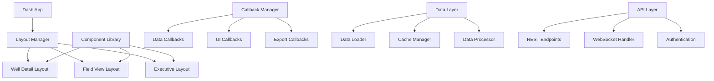

# Technical Specification

This is the technical specification for the spec detailed in @specs/modules/analysis/well-production-dashboard/spec.md

> Created: 2025-01-13
> Version: 1.0.0
> Module: Analysis

## Technical Requirements

### Core Functionality
- **Dashboard Infrastructure**: Plotly/Dash web application with responsive design
- **Well Visualization**: Individual well production charts and economic metrics
- **Field Aggregation**: Multi-well comparisons and field-level analytics
- **Interactive Components**: Dynamic filtering, drill-down, and data exploration
- **Export Module**: PDF and Excel report generation with charts
- **Real-Time Updates**: WebSocket-based live data refresh

### Performance Requirements
- Dashboard initial load <3 seconds
- Chart refresh <500ms for user interactions
- Support 50+ concurrent users
- Handle 1M+ data points efficiently
- API response time <200ms
- Export generation <10 seconds

### Browser Compatibility
- Chrome 90+
- Firefox 88+
- Safari 14+
- Edge 90+
- Mobile browsers (responsive design)

## Architecture Design

### Application Structure

```python
# Dashboard module structure
worldenergydata/
└── modules/
    └── analysis/
        └── dashboard/
            ├── __init__.py
            ├── app.py                  # Main Dash application
            ├── server.py               # Flask/FastAPI server
            ├── config.py               # Configuration management
            ├── layouts/
            │   ├── base.py            # Base layout template
            │   ├── well_detail.py     # Well detail view
            │   ├── field_view.py      # Field aggregation view
            │   └── executive.py       # Executive dashboard
            ├── components/
            │   ├── charts.py          # Reusable chart components
            │   ├── filters.py         # Filter controls
            │   ├── cards.py           # KPI cards
            │   └── tables.py          # Data tables
            ├── callbacks/
            │   ├── well_callbacks.py  # Well-specific callbacks
            │   ├── field_callbacks.py # Field-level callbacks
            │   └── export_callbacks.py # Export functionality
            ├── data/
            │   ├── loader.py          # Data loading
            │   ├── processor.py       # Data processing
            │   └── cache.py           # Caching layer
            ├── api/
            │   ├── endpoints.py       # REST API endpoints
            │   ├── models.py          # Data models
            │   └── auth.py            # Authentication
            ├── utils/
            │   ├── export.py          # Export utilities
            │   ├── formatters.py      # Data formatters
            │   └── validators.py      # Input validation
            └── assets/
                ├── styles.css         # Custom CSS
                ├── custom.js          # Custom JavaScript
                └── logo.png           # Branding assets
```

### Component Architecture



## Implementation Approach

### Phase 1: Core Dashboard Setup
- Initialize Dash application
- Set up routing and navigation
- Create base layouts
- Implement authentication

### Phase 2: Well Visualizations
- Build production charts
- Create economic metric cards
- Implement time series views
- Add data export functionality

### Phase 3: Field Analytics
- Develop aggregation logic
- Create comparison charts
- Build performance tables
- Implement heatmaps

### Phase 4: Interactivity
- Add filter controls
- Implement callbacks
- Create drill-down features
- Enable real-time updates

## Technology Stack

### Frontend Technologies
```python
# Frontend dependencies
dash>=2.0.0
plotly>=5.0.0
dash-bootstrap-components>=1.0.0
dash-daq>=0.5.0           # Gauges and indicators
dash-leaflet>=0.1.0       # Map visualizations
dash-ag-grid>=2.0.0       # Advanced data tables
```

### Backend Technologies
```python
# Backend dependencies
flask>=2.0.0              # Or fastapi>=0.70.0
pandas>=1.3.0
numpy>=1.21.0
redis>=4.0.0              # Caching
celery>=5.0.0             # Background tasks
sqlalchemy>=1.4.0         # Database ORM
gunicorn>=20.0.0          # Production server
```

### Development Tools
```python
# Development dependencies
pytest>=6.0.0
selenium>=4.0.0           # Browser testing
black>=21.0.0             # Code formatting
pylint>=2.0.0             # Code linting
pre-commit>=2.0.0         # Git hooks
```

## Dashboard Components

### Chart Components
```python
# components/charts.py
class ProductionChart:
    """Time series production chart with zoom/pan"""
    def __init__(self, data, config):
        self.figure = go.Figure()
        self.add_oil_trace()
        self.add_gas_trace()
        self.configure_layout()
    
class EconomicChart:
    """Economic metrics visualization"""
    def __init__(self, data, metric_type):
        self.figure = self.create_chart(metric_type)
        
class ComparisonChart:
    """Multi-well comparison visualization"""
    def __init__(self, wells, metric):
        self.figure = self.create_comparison()
```

### KPI Components
```python
# components/cards.py
class KPICard:
    """Key performance indicator card"""
    def __init__(self, title, value, trend):
        self.layout = self.create_card_layout()
        
class MetricGauge:
    """Gauge chart for metrics"""
    def __init__(self, value, min_val, max_val):
        self.figure = self.create_gauge()
```

## Data Management

### Caching Strategy
```python
# Redis cache configuration
REDIS_CONFIG = {
    'host': 'localhost',
    'port': 6379,
    'db': 0,
    'decode_responses': True,
    'socket_timeout': 5
}

# Cache keys structure
CACHE_KEYS = {
    'well_data': 'well:{well_id}:data',
    'field_agg': 'field:{field_id}:aggregation',
    'charts': 'chart:{chart_id}:figure',
    'reports': 'report:{report_id}'
}

# Cache TTL settings (seconds)
CACHE_TTL = {
    'well_data': 3600,      # 1 hour
    'field_agg': 1800,      # 30 minutes
    'charts': 600,          # 10 minutes
    'reports': 86400        # 24 hours
}
```

### Data Processing Pipeline
```python
class DataProcessor:
    def process_well_data(self, well_id):
        # Load raw data
        # Apply transformations
        # Calculate metrics
        # Cache results
        pass
    
    def aggregate_field_data(self, field_id):
        # Load well data
        # Perform aggregations
        # Calculate field metrics
        # Cache results
        pass
```

## Security Considerations

### Authentication
- JWT token-based authentication
- Session management with timeout
- Role-based access control (RBAC)
- Multi-factor authentication support

### Authorization Matrix
| Role | Well View | Field View | Export | Admin |
|------|-----------|------------|--------|-------|
| Viewer | Read | Read | No | No |
| Analyst | Read | Read | Yes | No |
| Manager | Read/Write | Read/Write | Yes | No |
| Admin | Full | Full | Yes | Yes |

### Security Headers
```python
# Security headers configuration
SECURITY_HEADERS = {
    'X-Frame-Options': 'DENY',
    'X-Content-Type-Options': 'nosniff',
    'X-XSS-Protection': '1; mode=block',
    'Content-Security-Policy': "default-src 'self'",
    'Strict-Transport-Security': 'max-age=31536000'
}
```

## Deployment Configuration

### Docker Configuration
```dockerfile
# Dockerfile
FROM python:3.9-slim
WORKDIR /app
COPY requirements.txt .
RUN pip install -r requirements.txt
COPY . .
EXPOSE 8050
CMD ["gunicorn", "app:server", "-b", "0.0.0.0:8050"]
```

### Kubernetes Deployment
```yaml
# deployment.yaml
apiVersion: apps/v1
kind: Deployment
metadata:
  name: well-dashboard
spec:
  replicas: 3
  selector:
    matchLabels:
      app: well-dashboard
  template:
    metadata:
      labels:
        app: well-dashboard
    spec:
      containers:
      - name: dashboard
        image: well-dashboard:latest
        ports:
        - containerPort: 8050
        env:
        - name: REDIS_URL
          value: redis://redis-service:6379
```

## Performance Optimization

### Frontend Optimization
- Lazy loading of components
- Virtual scrolling for large datasets
- Chart data decimation
- Progressive web app (PWA) features
- CDN for static assets

### Backend Optimization
- Database query optimization
- Materialized views for aggregations
- Connection pooling
- Async processing for heavy computations
- Horizontal scaling with load balancing

## Monitoring and Logging

### Application Monitoring
```python
# Monitoring configuration
MONITORING = {
    'metrics': ['response_time', 'error_rate', 'user_sessions'],
    'alerts': {
        'response_time': {'threshold': 1000, 'unit': 'ms'},
        'error_rate': {'threshold': 0.01, 'unit': 'percent'}
    }
}
```

### Logging Configuration
```python
# Logging setup
LOGGING_CONFIG = {
    'version': 1,
    'handlers': {
        'file': {
            'class': 'logging.FileHandler',
            'filename': 'dashboard.log',
            'level': 'INFO'
        },
        'console': {
            'class': 'logging.StreamHandler',
            'level': 'DEBUG'
        }
    },
    'root': {
        'level': 'INFO',
        'handlers': ['file', 'console']
    }
}
```