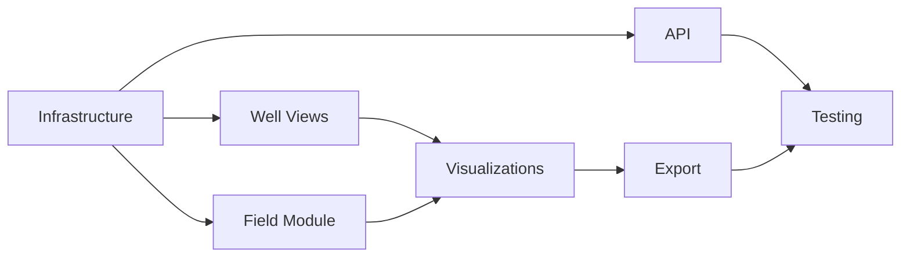

# Spec Tasks

These are the tasks to be completed for the spec detailed in @specs/modules/analysis/well-production-dashboard/spec.md

> Created: 2025-01-13
> Status: Ready for Implementation
> Module: Analysis
> Total Tasks: 48 subtasks across 7 main tasks
> Estimated Effort: 44-56 hours

## Tasks

### Task 1: Dashboard Infrastructure Setup

**Estimated Time:** 8-10 hours
**Priority:** Critical - Foundation for entire dashboard
**Dependencies:** None
**Purpose:** Initialize the Plotly/Dash application framework with routing, authentication, and base layouts

- [ ] 1.1 Write tests for dashboard app structure `[1 hour]` 🤖 `Agent: test-specialist`
- [ ] 1.2 Initialize Dash application framework `[1.5 hours]` 🤖 `Agent: frontend-specialist`
- [ ] 1.3 Configure routing and URL management `[1 hour]` 🤖 `Agent: frontend-specialist`
- [ ] 1.4 Set up asset management (CSS, JS, images) `[1 hour]` 🤖 `Agent: frontend-specialist`
- [ ] 1.5 Implement user authentication system `[2 hours]` 🤖 `Agent: security-specialist`
- [ ] 1.6 Create base layout templates `[1.5 hours]` 🤖 `Agent: frontend-specialist`
- [ ] 1.7 Configure development and production settings `[30 min]` 🤖 `Agent: devops-specialist`
- [ ] 1.8 Verify all tests pass `[30 min]` 🤖 `Agent: test-specialist`

### Task 2: Well Detail Views

**Estimated Time:** 6-8 hours
**Priority:** High - Core functionality for individual well analysis
**Dependencies:** Task 1
**Purpose:** Create detailed well pages with production charts, economic metrics, and data export capabilities

- [ ] 2.1 Write tests for well components `[45 min]` 🤖 `Agent: test-specialist`
- [ ] 2.2 Build production chart component `[1.5 hours]` 🤖 `Agent: visualization-specialist`
- [ ] 2.3 Create economic metrics display cards `[1 hour]` 🤖 `Agent: frontend-specialist`
- [ ] 2.4 Implement time series selector `[1 hour]` 🤖 `Agent: frontend-specialist`
- [ ] 2.5 Add data export functionality `[45 min]` 🤖 `Agent: general-purpose`
- [ ] 2.6 Create well information panel `[1 hour]` 🤖 `Agent: frontend-specialist`
- [ ] 2.7 Verify all tests pass `[30 min]` 🤖 `Agent: test-specialist`

### Task 3: Field Aggregation Module

**Estimated Time:** 6-8 hours
**Priority:** High - Essential for multi-well analysis
**Dependencies:** Task 1
**Purpose:** Implement field-level aggregations with comparative analysis and performance rankings

- [ ] 3.1 Write tests for aggregation logic `[1 hour]` 🤖 `Agent: test-specialist`
- [ ] 3.2 Create field overview dashboard `[1.5 hours]` 🤖 `Agent: data-specialist`
- [ ] 3.3 Build comparative analysis tools `[1.5 hours]` 🤖 `Agent: data-specialist`
- [ ] 3.4 Implement field production charts `[1 hour]` 🤖 `Agent: visualization-specialist`
- [ ] 3.5 Add field economic summaries `[1 hour]` 🤖 `Agent: financial-specialist`
- [ ] 3.6 Create well ranking tables `[1 hour]` 🤖 `Agent: frontend-specialist`
- [ ] 3.7 Verify all tests pass `[30 min]` 🤖 `Agent: test-specialist`

### Task 4: Interactive Visualization Components

**Estimated Time:** 8-10 hours
**Priority:** High - Critical for user experience
**Dependencies:** Tasks 2, 3
**Purpose:** Build interactive features including filters, callbacks, and dynamic chart controls

- [ ] 4.1 Write tests for callbacks and interactions `[1 hour]` 🤖 `Agent: test-specialist`
- [ ] 4.2 Implement filter controls and dropdowns `[1.5 hours]` 🤖 `Agent: ux-specialist`
- [ ] 4.3 Create date range selectors `[1 hour]` 🤖 `Agent: frontend-specialist`
- [ ] 4.4 Build reusable chart components library `[2 hours]` 🤖 `Agent: visualization-specialist`
- [ ] 4.5 Implement chart zoom, pan, and reset `[1 hour]` 🤖 `Agent: frontend-specialist`
- [ ] 4.6 Add interactive data point tooltips `[1 hour]` 🤖 `Agent: frontend-specialist`
- [ ] 4.7 Create dynamic chart type switching `[1 hour]` 🤖 `Agent: frontend-specialist`
- [ ] 4.8 Verify all tests pass `[30 min]` 🤖 `Agent: test-specialist`

### Task 5: Export and Integration Module

**Estimated Time:** 4-6 hours
**Priority:** Medium - Important for reporting
**Dependencies:** Task 4
**Purpose:** Enable data export capabilities including PDF reports, Excel files, and shareable links

- [ ] 5.1 Write tests for export functionality `[45 min]` 🤖 `Agent: test-specialist`
- [ ] 5.2 Implement chart image export `[1 hour]` 🤖 `Agent: general-purpose`
- [ ] 5.3 Create PDF dashboard snapshots `[1.5 hours]` 🤖 `Agent: general-purpose`
- [ ] 5.4 Add Excel data export `[1 hour]` 🤖 `Agent: general-purpose`
- [ ] 5.5 Build shareable dashboard links `[45 min]` 🤖 `Agent: frontend-specialist`
- [ ] 5.6 Verify all tests pass `[30 min]` 🤖 `Agent: test-specialist`

### Task 6: API Development

**Estimated Time:** 6-8 hours
**Priority:** High - Data access layer
**Dependencies:** Task 1
**Purpose:** Build RESTful API endpoints for data access, caching, and authentication

- [ ] 6.1 Write tests for API endpoints `[1 hour]` 🤖 `Agent: test-specialist`
- [ ] 6.2 Implement well data endpoints `[1 hour]` 🤖 `Agent: backend-specialist`
- [ ] 6.3 Create production data API `[1 hour]` 🤖 `Agent: backend-specialist`
- [ ] 6.4 Add field aggregation endpoints `[1 hour]` 🤖 `Agent: backend-specialist`
- [ ] 6.5 Implement caching layer `[1.5 hours]` 🤖 `Agent: performance-specialist`
- [ ] 6.6 Create export data endpoints `[1 hour]` 🤖 `Agent: backend-specialist`
- [ ] 6.7 Add authentication middleware `[1 hour]` 🤖 `Agent: security-specialist`
- [ ] 6.8 Verify all tests pass `[30 min]` 🤖 `Agent: test-specialist`

### Task 7: Testing and Deployment

**Estimated Time:** 6-8 hours
**Priority:** Critical - Final validation and deployment
**Dependencies:** All previous tasks
**Purpose:** Complete integration testing, performance validation, and production deployment preparation

- [ ] 7.1 Run end-to-end dashboard tests `[1.5 hours]` 🤖 `Agent: test-specialist`
- [ ] 7.2 Perform load testing `[1 hour]` 🤖 `Agent: performance-specialist`
- [ ] 7.3 Test cross-browser compatibility `[1 hour]` 🤖 `Agent: test-specialist`
- [ ] 7.4 Create deployment configuration `[1 hour]` 🤖 `Agent: devops-specialist`
- [ ] 7.5 Write user documentation `[1.5 hours]` 🤖 `Agent: documentation-specialist`
- [ ] 7.6 Verify production readiness `[1 hour]` 🤖 `Agent: review-specialist`

## Task Dependencies and Sequencing



## Effort Distribution

| Task Category | Hours | Percentage |
|--------------|-------|------------|
| Infrastructure | 8-10 | 18% |
| Core Features | 20-26 | 46% |
| Integration | 10-14 | 25% |
| Testing & Deploy | 6-8 | 11% |
| **Total** | **44-56** | **100%** |

## Priority and Risk Assessment

### High Priority (Critical Path)
- Task 1: Dashboard Infrastructure (foundation for all work)
- Task 2: Well Detail Views (core functionality)
- Task 6: API Development (data access layer)

### Medium Priority (Key Features)
- Task 3: Field Aggregation (value-add analytics)
- Task 4: Interactive Visualizations (user experience)

### Lower Priority (Enhancements)
- Task 5: Export Module (can start basic)
- Task 7: Advanced testing (iterative improvement)

## Parallelization Opportunities

- **Parallel Track 1**: Tasks 2 & 3 (after Task 1)
- **Parallel Track 2**: Tasks 4 & 6 (after Task 1)
- **Convergence Point**: Task 7 (requires all previous)

## Success Criteria

### Functional Requirements
- [ ] Dashboard displays all well production data correctly
- [ ] Field aggregations calculate accurately
- [ ] Interactive features work across browsers
- [ ] Export generates valid PDF/Excel files
- [ ] Authentication and authorization functioning

### Performance Requirements
- [ ] Dashboard initial load <3 seconds
- [ ] Chart refresh <500ms for interactions
- [ ] Support 50+ concurrent users
- [ ] Handle 1M+ data points efficiently
- [ ] API response time <200ms
- [ ] Export generation <10 seconds

### Quality Requirements
- [ ] Test coverage >85% for all modules
- [ ] Zero critical bugs in production
- [ ] WCAG 2.1 AA accessibility compliance
- [ ] Mobile responsive on all devices
- [ ] Documentation complete and accurate

## Implementation Notes

### Technology Stack
- **Framework**: Dash 2.0+ / Plotly 5.0+
- **Backend**: FastAPI or Flask
- **Database**: PostgreSQL with TimescaleDB
- **Cache**: Redis or in-memory
- **Authentication**: Flask-Login or custom JWT
- **Testing**: pytest, selenium
- **Deployment**: Docker, Kubernetes

### Application Structure
```
src/worldenergydata/modules/analysis/dashboard/
├── __init__.py
├── app.py                 # Main Dash application
├── layouts/
│   ├── base.py
│   ├── well_detail.py
│   └── field_view.py
├── components/
│   ├── charts.py
│   ├── filters.py
│   └── cards.py
├── callbacks/
│   ├── well_callbacks.py
│   └── field_callbacks.py
├── api/
│   ├── endpoints.py
│   └── models.py
├── utils/
│   ├── cache.py
│   └── export.py
└── assets/
    ├── styles.css
    └── custom.js
```

### Agent Assignments
- **Dashboard Infrastructure**: frontend-specialist agent
- **Well Views**: visualization-specialist agent
- **Field Aggregation**: data-specialist agent
- **Interactive Features**: ux-specialist agent
- **API Development**: backend-specialist agent
- **Testing**: test-specialist agent

### Performance Optimization Strategies
1. **Data Loading**: Implement pagination and virtual scrolling
2. **Caching**: Cache computed aggregations and frequent queries
3. **Lazy Loading**: Load visualizations on-demand
4. **CDN**: Serve static assets from CDN
5. **Database**: Index critical columns, use materialized views
6. **Frontend**: Minimize re-renders, use React.memo