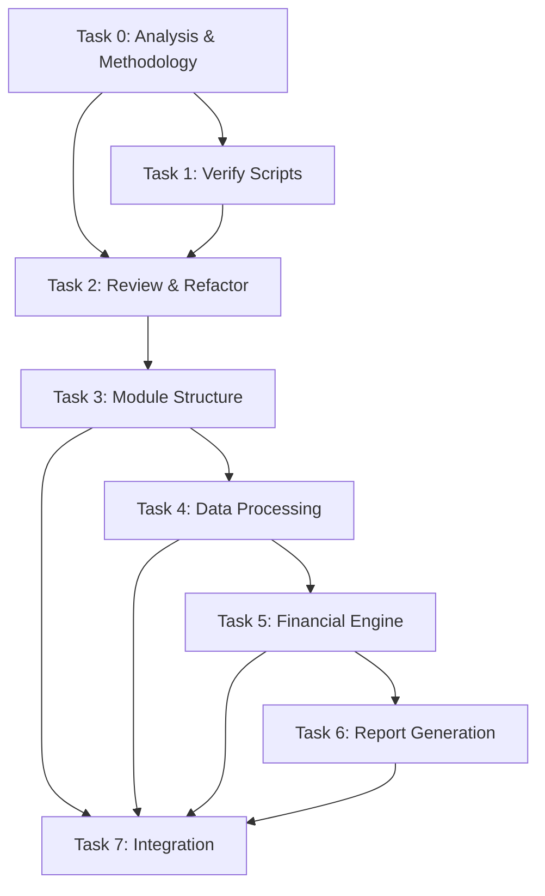

# Spec Tasks

These are the tasks to be completed for the spec detailed in @specs/modules/bsee/financial-analysis-sme-code/spec.md

> Created: 2025-08-19
> Status: Ready for Implementation
> Estimated Total Effort: 3-4 days

## Task Progress Overview

- [ ] Total Tasks: 8 major tasks, 64 subtasks  
- [x] Completed: 10/64 (16%)
- [ ] In Progress: 0
- [ ] Blocked: 0

## Tasks

### Task 0: Analyze Existing SME Code and Consolidate Methodology

**⚠️ CRITICAL NOTE:**

- **LATEST CODE TO IMPLEMENT:** `docs/modules/bsee/data/SME_Roy_attachments/2025-08-20/` - THIS IS THE PRIMARY IMPLEMENTATION TARGET
- **Previous versions (2025-07-29, 2025-07-30, 2025-08-15):** These are ONLY for reference to ensure no features are missed during migration
- **MANDATORY:** During analysis, verify ALL features from previous versions are captured in 2025-08-20 implementation

**Estimated Time:** 5-6 hours
**Priority:** Critical - Must Complete First
**Dependencies:** None
**Purpose:** Understand existing implementations, identify patterns, and create consolidated approach based on LATEST CODE (2025-08-20)

- [x] 0.1 Analyze code and documentation in `docs/modules/bsee/data/SME_Roy_attachments/2025-07-29/` (REFERENCE - for feature comparison) `1h` 🤖 `Agent: analysis-specialist`
- [x] 0.2 Analyze code and documentation in `docs/modules/bsee/data/SME_Roy_attachments/2025-07-30/` (REFERENCE - for feature comparison) `1h` 🤖 `Agent: analysis-specialist`
- [x] 0.3 Analyze code and documentation in `docs/modules/bsee/data/SME_Roy_attachments/2025-08-15/` (REFERENCE - for feature comparison) `1h` 🤖 `Agent: analysis-specialist`
- [x] 0.4 **PRIMARY ANALYSIS:** Thoroughly analyze LATEST code in `docs/modules/bsee/data/SME_Roy_attachments/2025-08-20/` - THIS IS THE IMPLEMENTATION TARGET `1.5h` 🤖 `Agent: analysis-specialist`
- [x] 0.5 Compare implementations: Ensure ALL features from previous versions (07-29, 07-30, 08-15) are present in 2025-08-20 code `45m` 🤖 `Agent: analysis-specialist`
- [x] 0.6 Create consolidated methodology document at `tests/modules/bsee/analysis/financial-analysis-sme-code/task-0-artifacts/consolidated_methodology.md` based on 2025-08-20 implementation `45m` 🤖 `Agent: documentation-specialist`
- [x] 0.7 Create unified analysis script at `tests/modules/bsee/analysis/financial-analysis-sme-code/task-0-artifacts/consolidated_analysis.py` using 2025-08-20 as base `30m` 🤖 `Agent: general-purpose`
- [x] 0.8 Document plan for integrating 2025-08-20 implementation with BSEE data in `data/modules/bsee/` `30m` 🤖 `Agent: documentation-specialist`
- [x] 0.9 Design implementation strategy for integrating 2025-08-20 code into main source in `src/` `30m` 🤖 `Agent: architecture-specialist`
- [x] 0.10 Verify 2025-08-20 implementation is complete and no features from older versions are missing `30m` 🤖 `Agent: review-specialist`

### Task 1: Verify and Enhance SME Scripts with Repository Data

**Estimated Time:** 4-5 hours
**Priority:** Critical - Validate Scripts Before Integration
**Dependencies:** Task 0
**Purpose:** Run and verify three SME scripts from 2025-08-20 folder using repository's binary and zip data sources

- [ ] 1.1 Modify `extract_drilling_and_completion_days.py` to use binary WAR files `1h` 🤖 `Agent: general-purpose`
  - [ ] 1.1.1 Update script to read .bin files from `data/modules/bsee/bin/war/` using `read_pickle` function
  - [ ] 1.1.2 Change output filename to `drilling_and_completion_days_by_api_enhanced.xlsx`
  - [ ] 1.1.3 Test script execution with binary files
- [ ] 1.2 Run enhanced drilling extraction script and verify output `30m` 🤖 `Agent: test-specialist`
  - [ ] 1.2.1 Execute modified script
  - [ ] 1.2.2 Compare output with original `drilling_and_completion_days_by_api.xlsx`
  - [ ] 1.2.3 Verify 100% match in data values
- [ ] 1.3 Modify `build_month_matrix_by_lease.py` to use OGORA zip files `1h` 🤖 `Agent: general-purpose`
  - [ ] 1.3.1 Update script to use files from `data/modules/bsee/zip/historical_production_yearly/`
  - [ ] 1.3.2 Add '_enhanced' suffix to output filename
  - [ ] 1.3.3 Test script execution with zip files
- [ ] 1.4 Run enhanced matrix builder script and verify output `30m` 🤖 `Agent: test-specialist`
  - [ ] 1.4.1 Execute modified script
  - [ ] 1.4.2 Compare output with original matrix files
  - [ ] 1.4.3 Verify 100% match in production data
- [ ] 1.5 Modify `Build_Development_Financials_V20.py` output naming `30m` 🤖 `Agent: general-purpose`
  - [ ] 1.5.1 Add '_enhanced' suffix to all output filenames
  - [ ] 1.5.2 Ensure no overwrite of existing files
- [ ] 1.6 Run enhanced financial builder script `30m` 🤖 `Agent: general-purpose`
  - [ ] 1.6.1 Execute modified script with enhanced inputs
  - [ ] 1.6.2 Verify successful completion
- [ ] 1.7 Create verification report documenting all results `30m` 🤖 `Agent: documentation-specialist`
  - [ ] 1.7.1 Document modifications made to each script
  - [ ] 1.7.2 Record verification results and match percentages
  - [ ] 1.7.3 Note any discrepancies or issues found

### Task 2: Review and Refactor Existing Financial Code

**Estimated Time:** 5-6 hours
**Priority:** Critical - Must Complete Before New Implementation
**Dependencies:** Task 0, Task 1
**Purpose:** Review all existing financial code in src, identify refactoring opportunities, and establish module structure

- [ ] 2.1 Analyze existing financial analysis code in `src/worldenergydata/modules/bsee/` `1h` 🤖 `Agent: analysis-specialist`
- [ ] 2.2 Review any NPV/economic analysis implementations in the codebase `45m` 🤖 `Agent: analysis-specialist`
- [ ] 2.3 Identify code that can be reused or refactored `45m` 🤖 `Agent: architecture-specialist`
- [ ] 2.4 Document existing module structure and propose reorganization `45m` 🤖 `Agent: documentation-specialist`
- [ ] 2.5 Create refactoring plan document at `specs/modules/bsee/financial-analysis-sme-code/refactoring_plan.md` `45m` 🤖 `Agent: architecture-specialist`
- [ ] 2.6 Design new module/submodule structure for financial analysis `30m` 🤖 `Agent: architecture-specialist`
- [ ] 2.7 Create module hierarchy diagram and integration points `30m` 🤖 `Agent: documentation-specialist`
- [ ] 2.8 Identify and document breaking changes if any `30m` 🤖 `Agent: review-specialist`
- [ ] 2.9 Get approval on refactoring approach before proceeding `30m` 🤖 `Agent: review-specialist`

### Task 3: Create Core Module Structure and Configuration

**Estimated Time:** 4-6 hours
**Priority:** High
**Dependencies:** Task 2

- [ ] 3.1 Write tests for module structure and configuration loading `1h` 🤖 `Agent: test-specialist`
- [ ] 3.2 Create module directory structure based on refactoring plan `30m` 🤖 `Agent: general-purpose`
- [ ] 3.3 Implement `config.py` with lease group mappings and constants from V18 `1h` 🤖 `Agent: general-purpose`
- [ ] 3.4 Create `__init__.py` with module exports `30m` 🤖 `Agent: general-purpose`
- [ ] 3.5 Implement configuration loader with YAML support `1h` 🤖 `Agent: general-purpose`
- [ ] 3.6 Create sample configuration file `config/sme_financial_config.yaml` `30m` 🤖 `Agent: general-purpose`
- [ ] 3.7 Verify all configuration tests pass `30m` 🤖 `Agent: test-specialist`

### Task 4: Implement Data Processing Components

**Estimated Time:** 6-8 hours
**Priority:** High
**Dependencies:** Task 3

- [ ] 4.1 Write tests for LeaseProcessor class `1.5h` 🤖 `Agent: test-specialist`
- [ ] 4.2 Implement `lease_processor.py` with LeaseProcessor class `2h` 🤖 `Agent: general-purpose`
- [ ] 4.3 Add lease grouping logic based on group_as_map `1h` 🤖 `Agent: general-purpose`
- [ ] 4.4 Implement data aggregation methods `1h` 🤖 `Agent: general-purpose`
- [ ] 4.5 Write tests for data validators `1h` 🤖 `Agent: test-specialist`
- [ ] 4.6 Implement `validators.py` with input/output validation `1.5h` 🤖 `Agent: general-purpose`
- [ ] 4.7 Verify all data processing tests pass `30m` 🤖 `Agent: test-specialist`

### Task 5: Implement Financial Calculation Engine

**Estimated Time:** 8-10 hours
**Priority:** High
**Dependencies:** Task 4

- [ ] 5.1 Write tests for CashFlowCalculator class `2h` 🤖 `Agent: test-specialist`
- [ ] 5.2 Implement `cash_flow_calculator.py` with core calculation methods `3h` 🤖 `Agent: financial-specialist`
- [ ] 5.3 Port monthly cash flow calculation logic from V18 `2h` 🤖 `Agent: financial-specialist`
- [ ] 5.4 Implement NPV calculation with numpy-financial `1h` 🤖 `Agent: financial-specialist`
- [ ] 5.5 Add tax calculation and net revenue methods `1h` 🤖 `Agent: financial-specialist`
- [ ] 5.6 Implement CAPEX (drilling and completion) cost processing `1h` 🤖 `Agent: financial-specialist`
- [ ] 5.7 Verify all financial calculation tests pass `30m` 🤖 `Agent: test-specialist`

### Task 6: Implement Report Generation and Formatting

**Estimated Time:** 6-8 hours
**Priority:** High
**Dependencies:** Task 5

- [ ] 6.1 Write tests for ReportGenerator class `1.5h` 🤖 `Agent: test-specialist`
- [ ] 6.2 Implement `report_generator.py` with Excel workbook creation `2h` 🤖 `Agent: general-purpose`
- [ ] 6.3 Port grouped timeseries generation logic from V18 `2h` 🤖 `Agent: general-purpose`
- [ ] 6.4 Write tests for Excel formatters `1h` 🤖 `Agent: test-specialist`
- [ ] 6.5 Implement `formatters.py` with column width and number formatting `1h` 🤖 `Agent: general-purpose`
- [ ] 6.6 Add README sheet generation with version info `30m` 🤖 `Agent: general-purpose`
- [ ] 6.7 Implement worksheet ordering (README first) `30m` 🤖 `Agent: general-purpose`
- [ ] 6.8 Verify all report generation tests pass `30m` 🤖 `Agent: test-specialist`

### Task 7: Integration, CLI, and End-to-End Testing

**Estimated Time:** 4-6 hours
**Priority:** High
**Dependencies:** Tasks 2-6

- [ ] 7.1 Write integration tests for complete pipeline `2h` 🤖 `Agent: test-specialist`
- [ ] 7.2 Implement `financial_analyzer.py` main orchestrator class `1.5h` 🤖 `Agent: general-purpose`
- [ ] 7.3 Create CLI interface in `__main__.py` `1h` 🤖 `Agent: general-purpose`
- [ ] 7.4 Add sample data files for testing `30m` 🤖 `Agent: general-purpose`
- [ ] 7.5 Run end-to-end test with SME Roy's sample data `30m` 🤖 `Agent: test-specialist`
- [ ] 7.6 Verify output matches expected V18 format `30m` 🤖 `Agent: test-specialist`
- [ ] 7.7 Generate coverage report and ensure >90% coverage `30m` 🤖 `Agent: test-specialist`

## Task Dependencies Graph

## Success Criteria

- [ ] All 64 subtasks completed
- [ ] SME scripts verified with repository data sources
- [ ] Test coverage >90% for all modules
- [ ] Generated Excel output matches V18 format exactly
- [ ] Processing 100+ leases completes in <60 seconds
- [ ] Memory usage stays under 2GB
- [ ] CLI interface works with all documented options
- [ ] Sample data produces expected results

## Risk Mitigation

1. **Data Format Changes**: Maintain backward compatibility with V18 format
2. **Performance Issues**: Implement batch processing for large datasets
3. **Memory Constraints**: Use chunked processing for very large files
4. **Excel Formatting**: Test with multiple Excel versions for compatibility

## Notes

- The existing V18 script in `docs/modules/bsee/data/SME_Roy_attachments/2025-08-15/` serves as the reference implementation
- Maintain compatibility with existing worldenergydata module patterns
- Use TDD approach - write tests before implementation
- Follow project's code style and best practices from `.agent-os/standards/`
- Review and refactor existing financial code before new implementation
