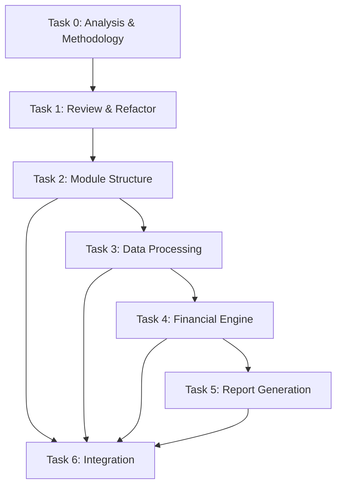

# Spec Tasks

These are the tasks to be completed for the spec detailed in @specs/modules/bsee/financial-analysis-v18/spec.md

> Created: 2025-08-19
> Status: Ready for Implementation
> Estimated Total Effort: 3-4 days

## Task Progress Overview

- [ ] Total Tasks: 7 major tasks, 56 subtasks
- [ ] Completed: 0/56 (0%)
- [ ] In Progress: 0
- [ ] Blocked: 0

## Tasks

### Task 0: Analyze Existing SME Code and Consolidate Methodology

**Estimated Time:** 4-5 hours
**Priority:** Critical - Must Complete First
**Dependencies:** None
**Purpose:** Understand existing implementations, identify patterns, and create consolidated approach

- [ ] 0.1 Analyze code and documentation in `docs/modules/bsee/data/SME_Roy_attachments/2025-07-29/` `1h` 🤖 `Agent: analysis-specialist`
- [ ] 0.2 Analyze code and documentation in `docs/modules/bsee/data/SME_Roy_attachments/2025-07-30/` `1h` 🤖 `Agent: analysis-specialist`
- [ ] 0.3 Analyze code and documentation in `docs/modules/bsee/data/SME_Roy_attachments/2025-08-15/` `1h` 🤖 `Agent: analysis-specialist`
- [ ] 0.4 Compare implementations across all three folders and identify commonalities/differences `45m` 🤖 `Agent: analysis-specialist`
- [ ] 0.5 Create consolidated methodology document at `specs/modules/bsee/financial-analysis-v18/consolidated_methodology.md` `45m` 🤖 `Agent: documentation-specialist`
- [ ] 0.6 Create unified analysis script at `specs/modules/bsee/financial-analysis-v18/consolidated_analysis.py` `30m` 🤖 `Agent: general-purpose`
- [ ] 0.7 Document plan for integrating with BSEE data in `data/modules/bsee/` `30m` 🤖 `Agent: documentation-specialist`
- [ ] 0.8 Design implementation strategy for main source code integration in `src/` `30m` 🤖 `Agent: architecture-specialist`
- [ ] 0.9 Verify all analyses are complete and methodology is clear `30m` 🤖 `Agent: review-specialist`

### Task 1: Review and Refactor Existing Financial Code

**Estimated Time:** 5-6 hours
**Priority:** Critical - Must Complete Before New Implementation
**Dependencies:** Task 0
**Purpose:** Review all existing financial code in src, identify refactoring opportunities, and establish module structure

- [ ] 1.1 Analyze existing financial analysis code in `src/worldenergydata/modules/bsee/` `1h` 🤖 `Agent: analysis-specialist`
- [ ] 1.2 Review any NPV/economic analysis implementations in the codebase `45m` 🤖 `Agent: analysis-specialist`
- [ ] 1.3 Identify code that can be reused or refactored `45m` 🤖 `Agent: architecture-specialist`
- [ ] 1.4 Document existing module structure and propose reorganization `45m` 🤖 `Agent: documentation-specialist`
- [ ] 1.5 Create refactoring plan document at `specs/modules/bsee/financial-analysis-v18/refactoring_plan.md` `45m` 🤖 `Agent: architecture-specialist`
- [ ] 1.6 Design new module/submodule structure for financial analysis `30m` 🤖 `Agent: architecture-specialist`
- [ ] 1.7 Create module hierarchy diagram and integration points `30m` 🤖 `Agent: documentation-specialist`
- [ ] 1.8 Identify and document breaking changes if any `30m` 🤖 `Agent: review-specialist`
- [ ] 1.9 Get approval on refactoring approach before proceeding `30m` 🤖 `Agent: review-specialist`

### Task 2: Create Core Module Structure and Configuration

**Estimated Time:** 4-6 hours
**Priority:** High
**Dependencies:** Task 1

- [ ] 2.1 Write tests for module structure and configuration loading `1h` 🤖 `Agent: test-specialist`
- [ ] 2.2 Create module directory structure based on refactoring plan `30m` 🤖 `Agent: general-purpose`
- [ ] 2.3 Implement `config.py` with lease group mappings and constants from V18 `1h` 🤖 `Agent: general-purpose`
- [ ] 2.4 Create `__init__.py` with module exports `30m` 🤖 `Agent: general-purpose`
- [ ] 2.5 Implement configuration loader with YAML support `1h` 🤖 `Agent: general-purpose`
- [ ] 2.6 Create sample configuration file `config/sme_financial_config.yaml` `30m` 🤖 `Agent: general-purpose`
- [ ] 2.7 Verify all configuration tests pass `30m` 🤖 `Agent: test-specialist`

### Task 3: Implement Data Processing Components

**Estimated Time:** 6-8 hours
**Priority:** High
**Dependencies:** Task 2

- [ ] 3.1 Write tests for LeaseProcessor class `1.5h` 🤖 `Agent: test-specialist`
- [ ] 3.2 Implement `lease_processor.py` with LeaseProcessor class `2h` 🤖 `Agent: general-purpose`
- [ ] 3.3 Add lease grouping logic based on group_as_map `1h` 🤖 `Agent: general-purpose`
- [ ] 3.4 Implement data aggregation methods `1h` 🤖 `Agent: general-purpose`
- [ ] 3.5 Write tests for data validators `1h` 🤖 `Agent: test-specialist`
- [ ] 3.6 Implement `validators.py` with input/output validation `1.5h` 🤖 `Agent: general-purpose`
- [ ] 3.7 Verify all data processing tests pass `30m` 🤖 `Agent: test-specialist`

### Task 4: Implement Financial Calculation Engine

**Estimated Time:** 8-10 hours
**Priority:** High
**Dependencies:** Task 3

- [ ] 4.1 Write tests for CashFlowCalculator class `2h` 🤖 `Agent: test-specialist`
- [ ] 4.2 Implement `cash_flow_calculator.py` with core calculation methods `3h` 🤖 `Agent: financial-specialist`
- [ ] 4.3 Port monthly cash flow calculation logic from V18 `2h` 🤖 `Agent: financial-specialist`
- [ ] 4.4 Implement NPV calculation with numpy-financial `1h` 🤖 `Agent: financial-specialist`
- [ ] 4.5 Add tax calculation and net revenue methods `1h` 🤖 `Agent: financial-specialist`
- [ ] 4.6 Implement CAPEX (drilling and completion) cost processing `1h` 🤖 `Agent: financial-specialist`
- [ ] 4.7 Verify all financial calculation tests pass `30m` 🤖 `Agent: test-specialist`

### Task 5: Implement Report Generation and Formatting

**Estimated Time:** 6-8 hours
**Priority:** High
**Dependencies:** Task 4

- [ ] 5.1 Write tests for ReportGenerator class `1.5h` 🤖 `Agent: test-specialist`
- [ ] 5.2 Implement `report_generator.py` with Excel workbook creation `2h` 🤖 `Agent: general-purpose`
- [ ] 5.3 Port grouped timeseries generation logic from V18 `2h` 🤖 `Agent: general-purpose`
- [ ] 5.4 Write tests for Excel formatters `1h` 🤖 `Agent: test-specialist`
- [ ] 5.5 Implement `formatters.py` with column width and number formatting `1h` 🤖 `Agent: general-purpose`
- [ ] 5.6 Add README sheet generation with version info `30m` 🤖 `Agent: general-purpose`
- [ ] 5.7 Implement worksheet ordering (README first) `30m` 🤖 `Agent: general-purpose`
- [ ] 5.8 Verify all report generation tests pass `30m` 🤖 `Agent: test-specialist`

### Task 6: Integration, CLI, and End-to-End Testing

**Estimated Time:** 4-6 hours
**Priority:** High
**Dependencies:** Tasks 1-5

- [ ] 6.1 Write integration tests for complete pipeline `2h` 🤖 `Agent: test-specialist`
- [ ] 6.2 Implement `financial_analyzer.py` main orchestrator class `1.5h` 🤖 `Agent: general-purpose`
- [ ] 6.3 Create CLI interface in `__main__.py` `1h` 🤖 `Agent: general-purpose`
- [ ] 6.4 Add sample data files for testing `30m` 🤖 `Agent: general-purpose`
- [ ] 6.5 Run end-to-end test with SME Roy's sample data `30m` 🤖 `Agent: test-specialist`
- [ ] 6.6 Verify output matches expected V18 format `30m` 🤖 `Agent: test-specialist`
- [ ] 6.7 Generate coverage report and ensure >90% coverage `30m` 🤖 `Agent: test-specialist`

## Task Dependencies Graph

## Success Criteria

- [ ] All 56 subtasks completed
- [ ] Test coverage >90% for all modules
- [ ] Generated Excel output matches V18 format exactly
- [ ] Processing 100+ leases completes in <60 seconds
- [ ] Memory usage stays under 2GB
- [ ] CLI interface works with all documented options
- [ ] Sample data produces expected results

## Risk Mitigation

1. **Data Format Changes**: Maintain backward compatibility with V18 format
2. **Performance Issues**: Implement batch processing for large datasets
3. **Memory Constraints**: Use chunked processing for very large files
4. **Excel Formatting**: Test with multiple Excel versions for compatibility

## Notes

- The existing V18 script in `docs/modules/bsee/data/SME_Roy_attachments/2025-08-15/` serves as the reference implementation
- Maintain compatibility with existing worldenergydata module patterns
- Use TDD approach - write tests before implementation
- Follow project's code style and best practices from `.agent-os/standards/`
- Review and refactor existing financial code before new implementation