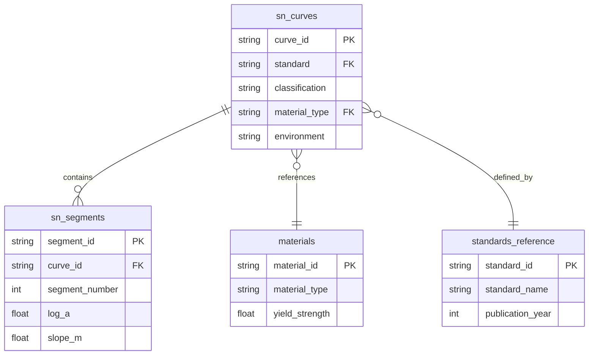

# Database Schema

This is the database schema implementation for the spec detailed in @specs/fatigue-sn-curve-database/spec.md

> Created: 2025-08-16
> Version: 1.0.0

## Schema Overview

The S-N curve database uses a hierarchical structure optimized for engineering queries and numerical efficiency. Data is stored in Parquet format with accompanying JSON metadata.

## Primary Data Tables

### sn_curves Table

Main table storing S-N curve definitions.

```sql
-- Logical schema (stored as Parquet)
CREATE TABLE sn_curves (
    curve_id VARCHAR(100) PRIMARY KEY,
    standard VARCHAR(50) NOT NULL,
    standard_version VARCHAR(20),
    classification VARCHAR(20) NOT NULL,
    material_type VARCHAR(50),
    material_grade VARCHAR(50),
    environment VARCHAR(50),
    cathodic_protection BOOLEAN,
    temperature_min FLOAT,
    temperature_max FLOAT,
    stress_ratio FLOAT,
    thickness_reference FLOAT,
    confidence_level VARCHAR(20),
    created_date TIMESTAMP,
    last_modified TIMESTAMP,
    source_document VARCHAR(200),
    notes TEXT
);

-- Example data
('DNV-C203-D-SW-CP', 'DNV-RP-C203', '2016', 'D', 'carbon_steel', 
 'S355', 'seawater', true, -10, 50, -1, 25, 'design', 
 '2025-08-16', '2025-08-16', 'DNV-RP-C203-2016.pdf', NULL)
```

### sn_segments Table

Stores individual segments of multi-linear S-N curves.

```sql
CREATE TABLE sn_segments (
    segment_id VARCHAR(100) PRIMARY KEY,
    curve_id VARCHAR(100) REFERENCES sn_curves(curve_id),
    segment_number INTEGER NOT NULL,
    log_a FLOAT NOT NULL,  -- Intercept: log N = log A - m * log S
    slope_m FLOAT NOT NULL,  -- Slope parameter
    stress_min FLOAT,  -- Lower bound stress (MPa)
    stress_max FLOAT,  -- Upper bound stress (MPa)
    cycles_min FLOAT,  -- Lower bound cycles
    cycles_max FLOAT,  -- Upper bound cycles
    endurance_limit FLOAT,  -- Fatigue limit if applicable
    UNIQUE(curve_id, segment_number)
);

-- Example: DNV D-curve has two segments
('DNV-C203-D-SW-CP-S1', 'DNV-C203-D-SW-CP', 1, 12.164, 3.0, 
 52.63, 1000, 1e4, 1e7, NULL)
('DNV-C203-D-SW-CP-S2', 'DNV-C203-D-SW-CP', 2, 15.606, 5.0, 
 0, 52.63, 1e7, 1e9, NULL)
```

### materials Table

Reference table for material properties.

```sql
CREATE TABLE materials (
    material_id VARCHAR(50) PRIMARY KEY,
    material_type VARCHAR(50) NOT NULL,
    material_grade VARCHAR(50),
    yield_strength_mpa FLOAT,
    tensile_strength_mpa FLOAT,
    elastic_modulus_gpa FLOAT,
    poisson_ratio FLOAT,
    density_kg_m3 FLOAT,
    specification VARCHAR(100)
);

-- Example materials
('CS-S355', 'carbon_steel', 'S355', 355, 490, 210, 0.3, 7850, 'EN 10025')
('SS-316L', 'stainless_steel', '316L', 240, 530, 193, 0.3, 8000, 'ASTM A240')
```

### standards_reference Table

Metadata about standards and their versions.

```sql
CREATE TABLE standards_reference (
    standard_id VARCHAR(50) PRIMARY KEY,
    standard_name VARCHAR(100) NOT NULL,
    organization VARCHAR(100),
    version VARCHAR(20),
    publication_year INTEGER,
    title TEXT,
    scope TEXT,
    url VARCHAR(500)
);

-- Example standards
('DNV-RP-C203-2016', 'DNV-RP-C203', 'DNV GL', '2016', 2016,
 'Fatigue design of offshore steel structures', 
 'Recommended practice for fatigue design and analysis',
 'https://www.dnv.com/oilgas/download/dnv-rp-c203.html')
```

## JSON Metadata Structure

### curve_metadata.json

Supplementary metadata not suitable for tabular storage.

```json
{
  "DNV-C203-D-SW-CP": {
    "test_conditions": {
      "specimen_type": "welded_joint",
      "surface_finish": "as_welded",
      "test_frequency": "0.2-20 Hz",
      "load_type": "axial"
    },
    "applicable_structures": [
      "tubular_joints",
      "plate_connections",
      "stiffener_attachments"
    ],
    "thickness_correction": {
      "method": "thickness_effect",
      "equation": "(t_ref/t)^0.25",
      "reference_thickness": 25,
      "applicable_range": [16, 100]
    },
    "safety_factors": {
      "design_life": 2.0,
      "inspection_category": {
        "no_access": 10,
        "underwater": 2,
        "above_water": 1
      }
    },
    "references": [
      {
        "type": "validation",
        "source": "Joint Industry Project",
        "year": 2015
      }
    ]
  }
}
```

## Data Relationships



## Index Strategy

### Primary Indexes
- `curve_id` - Unique identifier for direct lookups
- `(standard, classification)` - Common query pattern
- `material_type` - Material-based searches
- `environment` - Environmental condition queries

### Composite Indexes
- `(standard, material_type, environment)` - Complex queries
- `(material_grade, environment)` - Material comparison
- `(confidence_level, standard)` - Statistical analysis

## Data Validation Rules

### Curve Validation
```python
VALIDATION_RULES = {
    "curve_id": {
        "pattern": r"^[A-Z0-9\-]+$",
        "max_length": 100
    },
    "slope_m": {
        "min": 2.0,
        "max": 10.0,
        "typical": [3.0, 5.0]
    },
    "log_a": {
        "min": 10.0,
        "max": 20.0
    },
    "stress_ratio": {
        "min": -1.0,
        "max": 1.0
    },
    "thickness_reference": {
        "min": 0,
        "max": 500,
        "unit": "mm"
    }
}
```

### Segment Validation
- Segments must be continuous (no gaps)
- Segments must not overlap
- Stress ranges must be positive
- Cycles must increase with decreasing stress

## Storage Format Specifications

### Parquet Configuration
```python
# Parquet write options
parquet_config = {
    "compression": "snappy",
    "compression_level": 9,
    "row_group_size": 100000,
    "data_page_size": 1048576,  # 1MB
    "dictionary_encoding": True,
    "schema_version": "1.0"
}

# Column types
schema = pa.schema([
    ("curve_id", pa.string()),
    ("standard", pa.string()),
    ("classification", pa.string()),
    ("log_a", pa.float64()),
    ("slope_m", pa.float64()),
    ("stress_min", pa.float64()),
    ("stress_max", pa.float64()),
])
```

### File Organization
```
data/
├── sn_curves.parquet        # Main curves table
├── sn_segments.parquet      # Curve segments
├── materials.parquet        # Material properties
├── standards_ref.parquet    # Standards metadata
├── metadata/
│   ├── curve_metadata.json  # Additional metadata
│   ├── validation_log.json  # Data validation history
│   └── schema_version.json  # Schema version info
└── cache/
    └── query_cache.pkl      # Cached query results
```

## Migration and Versioning

### Schema Versioning
```json
{
  "version": "1.0.0",
  "created": "2025-08-16",
  "migrations": [
    {
      "version": "1.0.0",
      "date": "2025-08-16",
      "description": "Initial schema",
      "breaking_changes": false
    }
  ],
  "compatibility": {
    "min_version": "1.0.0",
    "max_version": "1.x.x"
  }
}
```

### Data Migration Strategy
1. Version all schema changes
2. Maintain backward compatibility for 2 major versions
3. Provide migration scripts for updates
4. Validate data integrity after migration
5. Keep audit log of all changes