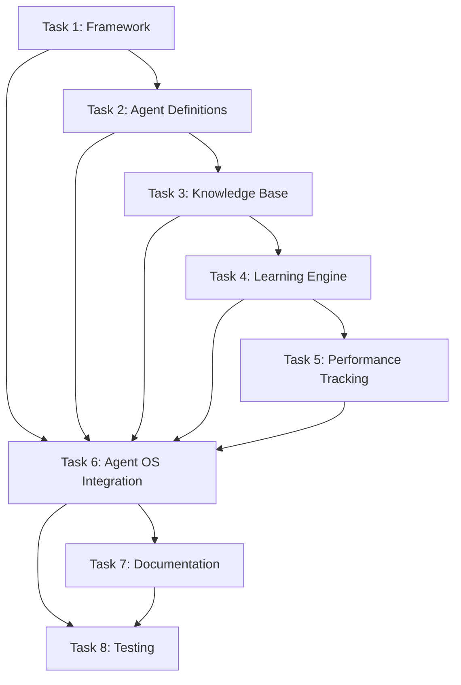

# Spec Tasks

These are the tasks to be completed for the spec detailed in @specs/modules/infrastructure/sub-agents-system/spec.md

> Created: 2025-07-25
> Status: Ready for Implementation
> Estimated Total Effort: 42-50 hours (5-6 days)

## Task Progress Overview

- [ ] Total Tasks: 8 major tasks, 59 subtasks
- [ ] Completed: 0/59 (0%)
- [ ] In Progress: 0
- [ ] Blocked: 0

## Tasks

### Task 1: Create Agent Framework Infrastructure

**Estimated Time:** 4-5 hours
**Priority:** Critical - Foundation for entire system
**Dependencies:** None
**Purpose:** Establish the core framework for managing specialized AI agents

- [ ] 1.1 Write tests for agent framework directory structure and file operations `45m` 🤖 `Agent: test-specialist`
- [ ] 1.2 Create .agent-os/agents/ directory structure with core/, knowledge_bases/, learning/, and framework/ subdirectories `30m` 🤖 `Agent: general-purpose`
- [ ] 1.3 Implement agent_loader.py for YAML configuration loading and validation `1h` 🤖 `Agent: general-purpose`
- [ ] 1.4 Create base agent configuration template with metadata, knowledge domains, and learning metrics `45m` 🤖 `Agent: architecture-specialist`
- [ ] 1.5 Implement agent registry for tracking available agents `45m` 🤖 `Agent: general-purpose`
- [ ] 1.6 Create agent selector mechanism for choosing appropriate agents `45m` 🤖 `Agent: general-purpose`
- [ ] 1.7 Verify all tests pass for basic framework structure `30m` 🤖 `Agent: test-specialist`

### Task 2: Implement Specialized Agent Definitions

**Estimated Time:** 5-6 hours
**Priority:** Critical - Core functionality
**Dependencies:** Task 1
**Purpose:** Create the five specialized agents with domain-specific configurations

**Parallel Execution Opportunity:** Tasks 2.2-2.6 can be executed simultaneously

- [ ] 2.1 Write tests for specialized agent configuration validation and loading `1h` 🤖 `Agent: test-specialist`
- [ ] 2.2 Create energy_economics.yaml agent configuration with NPV analysis and cost estimation domains `45m` 🤖 `Agent: energy-specialist` ⚡
- [ ] 2.3 Create petroleum_engineering.yaml agent configuration with decline curve and production forecasting domains `45m` 🤖 `Agent: petroleum-specialist` ⚡
- [ ] 2.4 Create data_quality.yaml agent configuration with validation and cleaning domains `45m` 🤖 `Agent: data-specialist` ⚡
- [ ] 2.5 Create documentation.yaml agent configuration with technical writing and API documentation domains `45m` 🤖 `Agent: documentation-specialist` ⚡
- [ ] 2.6 Create testing_qa.yaml agent configuration with code review and quality assurance domains `45m` 🤖 `Agent: test-specialist` ⚡
- [ ] 2.7 Implement agent capability matrix for skill assessment `45m` 🤖 `Agent: architecture-specialist`
- [ ] 2.8 Verify all tests pass for agent configuration loading and validation `30m` 🤖 `Agent: test-specialist`

### Task 3: Build Knowledge Base System

**Estimated Time:** 6-7 hours
**Priority:** High - Required for agent expertise
**Dependencies:** Task 2
**Purpose:** Create structured knowledge repositories for each specialized agent

**Parallel Execution Opportunity:** Knowledge bases for all agents can be created simultaneously

- [ ] 3.1 Write tests for knowledge base file structure creation and content management `1h` 🤖 `Agent: test-specialist`
- [ ] 3.2 Create knowledge base directory structure for each specialized agent `45m` 🤖 `Agent: general-purpose` ⚡
- [ ] 3.3 Implement knowledge base content templates with concepts/, methodologies/, industry_standards/, and code_examples/ subdirectories `1h` 🤖 `Agent: architecture-specialist`
- [ ] 3.4 Populate initial knowledge base content for energy economics agent `1h` 🤖 `Agent: energy-specialist`
- [ ] 3.5 Populate initial knowledge base content for petroleum engineering agent `1h` 🤖 `Agent: petroleum-specialist`
- [ ] 3.6 Create knowledge base search and retrieval functionality `1h` 🤖 `Agent: general-purpose`
- [ ] 3.7 Implement knowledge base indexing for fast searches `45m` 🤖 `Agent: general-purpose`
- [ ] 3.8 Verify all tests pass for knowledge base operations and content access `30m` 🤖 `Agent: test-specialist`

### Task 4: Develop Continuous Learning Engine

**Estimated Time:** 7-8 hours
**Priority:** High - Enables agent improvement
**Dependencies:** Task 3
**Purpose:** Implement automated learning system for knowledge updates

- [ ] 4.1 Write tests for learning schedule management and resource integration `1h` 🤖 `Agent: test-specialist`
- [ ] 4.2 Implement learning_engine.py with weekly learning cycle automation `1.5h` 🤖 `Agent: automation-specialist`
- [ ] 4.3 Create learning resource index system for tracking industry publications and technical papers `1h` 🤖 `Agent: general-purpose`
- [ ] 4.4 Implement knowledge base update mechanisms during learning sessions `1h` 🤖 `Agent: general-purpose`
- [ ] 4.5 Create learning session logging and progress tracking `45m` 🤖 `Agent: general-purpose`
- [ ] 4.6 Add schedule dependency for automated weekly learning cycles `45m` 🤖 `Agent: automation-specialist`
- [ ] 4.7 Implement learning effectiveness metrics `45m` 🤖 `Agent: analytics-specialist`
- [ ] 4.8 Create learning report generator `45m` 🤖 `Agent: documentation-specialist`
- [ ] 4.9 Verify all tests pass for learning automation and resource integration `30m` 🤖 `Agent: test-specialist`

### Task 5: Implement Performance Tracking System

**Estimated Time:** 5-6 hours
**Priority:** High - Measures system effectiveness
**Dependencies:** Task 4
**Purpose:** Track and analyze agent performance over time

- [ ] 5.1 Write tests for performance metrics calculation and CSV file operations `1h` 🤖 `Agent: test-specialist`
- [ ] 5.2 Implement performance_tracker.py for agent effectiveness monitoring `1h` 🤖 `Agent: analytics-specialist`
- [ ] 5.3 Create CSV-based performance metrics storage system `45m` 🤖 `Agent: general-purpose`
- [ ] 5.4 Implement performance score calculation algorithms based on learning outcomes `1h` 🤖 `Agent: analytics-specialist`
- [ ] 5.5 Create performance trend analysis and reporting functionality `1h` 🤖 `Agent: analytics-specialist`
- [ ] 5.6 Implement agent skill assessment (10-point system) `45m` 🤖 `Agent: analytics-specialist`
- [ ] 5.7 Verify all tests pass for performance tracking and metrics management `30m` 🤖 `Agent: test-specialist`

### Task 6: Integrate with Agent OS Workflow

**Estimated Time:** 5-6 hours
**Priority:** Critical - Enables system usage
**Dependencies:** Tasks 1-5
**Purpose:** Connect sub-agents system with existing Agent OS infrastructure

- [ ] 6.1 Write tests for Agent OS workflow integration and command accessibility `1h` 🤖 `Agent: test-specialist`
- [ ] 6.2 Update Agent OS instructions to support specialized agent invocation `45m` 🤖 `Agent: general-purpose`
- [ ] 6.3 Create agent selection mechanism within existing spec creation workflow `1h` 🤖 `Agent: architecture-specialist`
- [ ] 6.4 Implement agent assistance integration in task execution workflow `1h` 🤖 `Agent: architecture-specialist`
- [ ] 6.5 Update CLAUDE.md documentation with sub-agents system usage instructions `45m` 🤖 `Agent: documentation-specialist`
- [ ] 6.6 Create slash command for agent invocation `/use-agent <agent-name>` `45m` 🤖 `Agent: general-purpose`
- [ ] 6.7 Verify all tests pass for complete Agent OS integration `30m` 🤖 `Agent: test-specialist`

### Task 7: Documentation and User Guide Creation

**Estimated Time:** 4-5 hours
**Priority:** High - Ensures system usability
**Dependencies:** Tasks 1-6
**Purpose:** Create comprehensive documentation for users and administrators

**Parallel Execution Opportunity:** Documentation sections can be written concurrently

- [ ] 7.1 Write tests for documentation completeness and accuracy validation `45m` 🤖 `Agent: test-specialist`
- [ ] 7.2 Create comprehensive README.md for the sub-agents system `45m` 🤖 `Agent: documentation-specialist` ⚡
- [ ] 7.3 Document agent configuration format and customization options `45m` 🤖 `Agent: documentation-specialist` ⚡
- [ ] 7.4 Create user guide for interacting with specialized agents `45m` 🤖 `Agent: documentation-specialist` ⚡
- [ ] 7.5 Document learning system administration and resource management `45m` 🤖 `Agent: documentation-specialist` ⚡
- [ ] 7.6 Create troubleshooting guide for common agent system issues `30m` 🤖 `Agent: documentation-specialist`
- [ ] 7.7 Verify all tests pass for documentation quality and completeness `30m` 🤖 `Agent: test-specialist`

### Task 8: System Testing and Validation

**Estimated Time:** 6-7 hours
**Priority:** Critical - Ensures quality
**Dependencies:** All previous tasks
**Purpose:** Comprehensive testing of the complete sub-agents system

**Parallel Execution Opportunity:** Cross-platform testing can run simultaneously

- [ ] 8.1 Write comprehensive integration tests for complete sub-agents system `1.5h` 🤖 `Agent: test-specialist`
- [ ] 8.2 Execute end-to-end testing with all five specialized agents `1h` 🤖 `Agent: test-specialist`
- [ ] 8.3 Test learning cycle automation with mock resource updates `1h` 🤖 `Agent: test-specialist`
- [ ] 8.4 Validate performance tracking accuracy and trend analysis `45m` 🤖 `Agent: analytics-specialist`
- [ ] 8.5 Test Agent OS workflow integration with real-world scenarios `1h` 🤖 `Agent: test-specialist`
- [ ] 8.6 Conduct cross-platform compatibility testing (Windows, Linux, macOS) `1h` 🤖 `Agent: test-specialist` ⚡
- [ ] 8.7 Performance benchmark testing (response time, memory usage) `45m` 🤖 `Agent: performance-specialist`
- [ ] 8.8 Verify all tests pass including performance regression tests `30m` 🤖 `Agent: test-specialist`

## Task Dependencies Graph

## Success Criteria

- [ ] All 59 subtasks completed
- [ ] 5 specialized agents fully operational
- [ ] Weekly learning cycles execute automatically
- [ ] Performance metrics show positive trends
- [ ] Test coverage >90% for all components
- [ ] Agent response time <2 seconds
- [ ] Documentation comprehensive and accurate
- [ ] Integration with Agent OS seamless

## Risk Mitigation

1. **Complex Agent Interactions**: Start with independent agents, add interaction features incrementally
2. **Learning Resource Availability**: Build initial system with local resources, add external APIs later
3. **Performance Overhead**: Implement lazy loading and caching from the start
4. **Knowledge Base Growth**: Design with scalability in mind, implement pruning strategies

## Notes

- Tasks marked with ⚡ indicate parallel execution opportunities
- Agent assignments leverage specialized expertise for optimal results
- TDD approach ensures quality throughout development
- Performance metrics built into system from the start
- Documentation created alongside implementation, not after