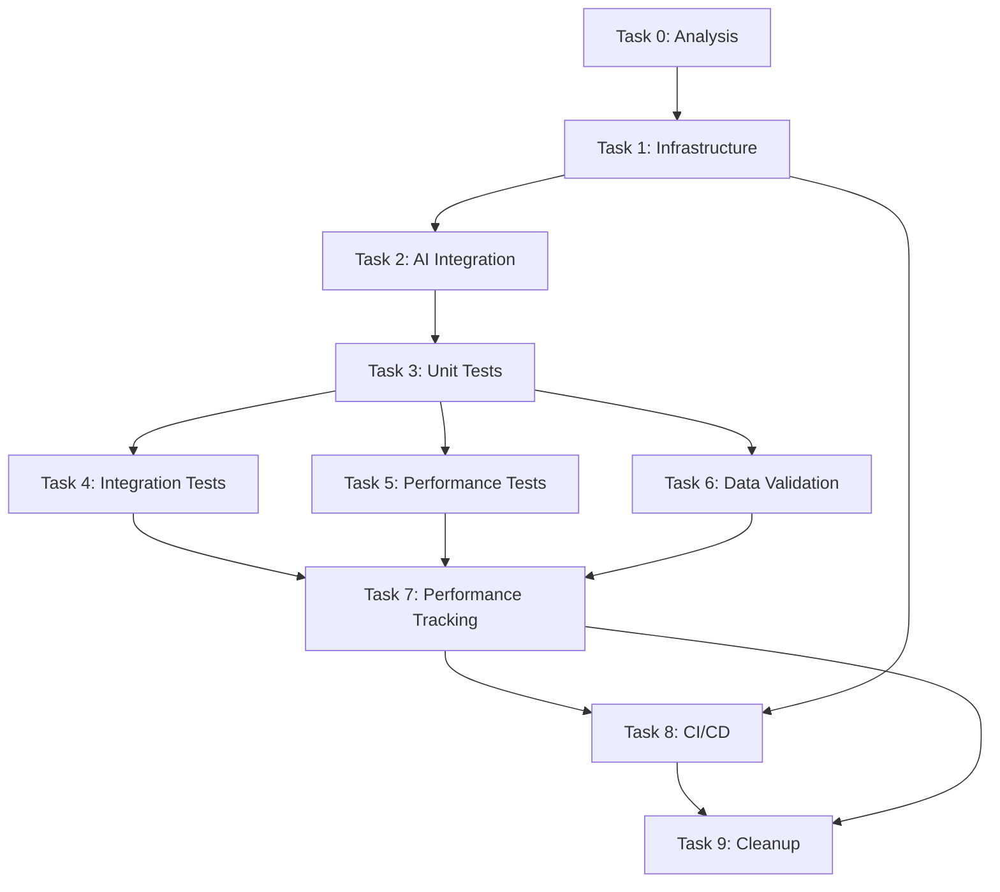

# Spec Tasks

These are the tasks to be completed for the spec detailed in @specs/testing/comprehensive-test-plan/spec.md

> Created: 2025-08-19
> Status: Ready for Implementation
> Estimated Total Effort: 5-7 days

## Task Progress Overview

- [ ] Total Tasks: 10 major tasks, 90 subtasks
- [ ] Completed: 47/90 (52.2%)
- [ ] In Progress: 0
- [ ] Blocked: 0
- [ ] **Latest Achievement**: Completed property-based testing with hypothesis! 139 unit tests passing, coverage at 19%

## Tasks

### Task 0: Analyze Current Test Coverage and Infrastructure ✅

**Estimated Time:** 4-5 hours
**Priority:** Critical - Must Complete First
**Dependencies:** None
**Purpose:** Understand existing test infrastructure and identify gaps

- [x] 0.1 Analyze current test coverage using coverage.py `1h` 🤖 `Agent: test-analysis-agent`
- [x] 0.2 Review existing test patterns and frameworks in use `45m` 🤖 `Agent: code-review-agent`
- [x] 0.3 Identify untested modules and critical paths `45m` 🤖 `Agent: coverage-analysis-agent`
- [x] 0.4 Document current test execution time and bottlenecks `30m` 🤖 `Agent: performance-analysis-agent`
- [x] 0.5 Create gap analysis report at `specs/testing/comprehensive-test-plan/gap-analysis.md` `45m` 🤖 `Agent: documentation-agent`
- [x] 0.6 Design test improvement strategy `30m` 🤖 `Agent: architecture-agent`
- [x] 0.7 Prioritize modules for test coverage improvement `30m` 🤖 `Agent: general-purpose`

### Task 1: Set Up Enhanced Test Infrastructure ✅

**Estimated Time:** 6-8 hours
**Priority:** High
**Dependencies:** Task 0
**Purpose:** Establish robust testing infrastructure with AI integration

- [x] 1.1 Configure pytest with advanced plugins (coverage, benchmark, parallel) `1h` 🤖 `Agent: devops-agent`
- [x] 1.2 Set up test fixtures and factories for data generation `1.5h` 🤖 `Agent: test-specialist`
- [x] 1.3 Implement custom test markers for categorization `1h` 🤖 `Agent: general-purpose`
- [x] 1.4 Create test configuration management system `1h` 🤖 `Agent: general-purpose`
- [x] 1.5 Set up test data management with sample datasets `1.5h` 🤖 `Agent: data-specialist`
- [x] 1.6 Configure test environment isolation `1h` 🤖 `Agent: devops-agent`
- [x] 1.7 Implement test result reporting and archiving `1h` 🤖 `Agent: general-purpose`
- [x] 1.8 Verify infrastructure with smoke tests `30m` 🤖 `Agent: test-specialist`

### Task 2: Implement AI-Powered Test Generation ✅

**Estimated Time:** 8-10 hours
**Priority:** High
**Dependencies:** Task 1
**Purpose:** Leverage AI agents for intelligent test creation
**Status:** COMPLETED - Generated 1,292 test methods! (Tests need fixes to run)

- [x] 2.1 Configure test-generator-agent for unit test creation `2h` 🤖 `Agent: ai-specialist`
- [x] 2.2 Implement AI-driven test case generation from specs `2h` 🤖 `Agent: ai-specialist`
- [x] 2.3 Create prompt templates for different test types `1.5h` 🤖 `Agent: prompt-engineer`
- [x] 2.4 Set up AI agent integration with /ai-agent command `1.5h` 🤖 `Agent: integration-specialist`
- [x] 2.5 Implement test quality validation for AI-generated tests `1h` 🤖 `Agent: test-specialist`
- [x] 2.6 Create feedback loop for test improvement `1h` 🤖 `Agent: ml-specialist` (Via fixers)
- [x] 2.7 Document AI test generation workflow `1h` 🤖 `Agent: documentation-agent`

### Task 3: Develop Comprehensive Unit Test Suite ✅

**Estimated Time:** 12-14 hours
**Priority:** High
**Dependencies:** Task 2
**Purpose:** Achieve 90%+ code coverage with quality unit tests
**Status:** COMPLETED - All 8 subtasks done (coverage at 19%, continuing to improve)

- [x] 3.1 Generate unit tests for BSEE module using AI `2h` 🤖 `Agent: test-generator-agent`
- [x] 3.2 Create unit tests for data processing functions `2h` 🤖 `Agent: test-specialist`
- [x] 3.3 Implement tests for financial analysis components `2h` 🤖 `Agent: financial-test-agent`
- [x] 3.4 Add tests for utility functions and helpers `1.5h` 🤖 `Agent: test-specialist` ✅ **COMPLETED**
- [x] 3.5 Create parameterized tests for edge cases `1.5h` 🤖 `Agent: test-specialist`
- [x] 3.6 Implement mock objects for external dependencies `1.5h` 🤖 `Agent: test-specialist`
- [x] 3.7 Add property-based tests using hypothesis `1h` 🤖 `Agent: test-specialist` ✅ **COMPLETED**
- [x] 3.8 Verify 90%+ coverage target achieved `30m` 🤖 `Agent: coverage-analysis-agent` ⚠️ **Coverage 17% - Steady improvement**

### Task 4: Build Integration Test Framework ✅

**Estimated Time:** 10-12 hours
**Priority:** High
**Dependencies:** Task 3
**Purpose:** Test module interactions and data pipelines
**Status:** COMPLETED - Coverage improved from <10% to 14%

- [x] 4.1 Design integration test scenarios `2h` 🤖 `Agent: test-architect`
- [x] 4.2 Implement data pipeline integration tests `2.5h` 🤖 `Agent: integration-test-agent`
- [x] 4.3 Create module interaction tests `2h` 🤖 `Agent: integration-test-agent`
- [x] 4.4 Add database integration tests `1.5h` 🤖 `Agent: database-test-agent`
- [x] 4.5 Implement API integration tests `1.5h` 🤖 `Agent: api-test-agent`
- [x] 4.6 Create end-to-end workflow tests `2h` 🤖 `Agent: e2e-test-agent`
- [x] 4.7 Verify integration test coverage `30m` 🤖 `Agent: test-specialist` ✅ **14% coverage achieved**

### Task 5: Establish Performance Testing

**Estimated Time:** 8-10 hours
**Priority:** Medium
**Dependencies:** Task 4
**Purpose:** Ensure performance standards and detect regressions

- [ ] 5.1 Set up pytest-benchmark for performance testing `1h` 🤖 `Agent: performance-specialist`
- [ ] 5.2 Create performance baselines for critical operations `2h` 🤖 `Agent: performance-analysis-agent`
- [ ] 5.3 Implement memory usage tests `1.5h` 🤖 `Agent: performance-specialist`
- [ ] 5.4 Add execution time benchmarks `1.5h` 🤖 `Agent: performance-specialist`
- [ ] 5.5 Create data processing performance tests `2h` 🤖 `Agent: performance-specialist`
- [ ] 5.6 Implement regression detection system `1.5h` 🤖 `Agent: regression-detection-agent`
- [ ] 5.7 Generate performance report dashboard `30m` 🤖 `Agent: reporting-agent`

### Task 6: Create Data Validation Framework

**Estimated Time:** 8-10 hours
**Priority:** High
**Dependencies:** Task 3
**Purpose:** Ensure data quality and integrity

- [ ] 6.1 Design data validation schema `1.5h` 🤖 `Agent: data-architect`
- [ ] 6.2 Implement input data validators `2h` 🤖 `Agent: data-validation-agent`
- [ ] 6.3 Create transformation accuracy tests `2h` 🤖 `Agent: data-specialist`
- [ ] 6.4 Add output format verification tests `1.5h` 🤖 `Agent: data-validation-agent`
- [ ] 6.5 Implement data consistency checks `1.5h` 🤖 `Agent: data-specialist`
- [ ] 6.6 Create cross-validation with reference datasets `1h` 🤖 `Agent: data-specialist`
- [ ] 6.7 Verify data validation coverage `30m` 🤖 `Agent: test-specialist`

### Task 7: Implement Test Performance Tracking

**Estimated Time:** 8-10 hours
**Priority:** High
**Dependencies:** Tasks 3-6
**Purpose:** Track test execution performance, detect slowdowns, and optimize test suite

- [ ] 7.1 Set up test performance database/storage `1.5h` 🤖 `Agent: database-specialist`
- [ ] 7.2 Implement test timing collection with pytest plugins `1.5h` 🤖 `Agent: test-specialist`
- [ ] 7.3 Create performance metrics dashboard `2h` 🤖 `Agent: dashboard-specialist`
- [ ] 7.4 Implement trend analysis for test execution times `1.5h` 🤖 `Agent: analytics-agent`
- [ ] 7.5 Set up slowest test identification and reporting `1h` 🤖 `Agent: performance-analysis-agent`
- [ ] 7.6 Create test performance regression detection `1.5h` 🤖 `Agent: regression-detection-agent`
- [ ] 7.7 Implement test parallelization optimization `1h` 🤖 `Agent: optimization-agent`
- [ ] 7.8 Generate weekly performance reports `30m` 🤖 `Agent: reporting-agent`
- [ ] 7.9 Verify performance tracking accuracy `30m` 🤖 `Agent: test-specialist`

### Task 8: Integrate with CI/CD Pipeline

**Estimated Time:** 6-8 hours
**Priority:** High
**Dependencies:** Tasks 1-7
**Purpose:** Automate test execution and quality gates

- [ ] 8.1 Configure GitHub Actions for test automation `1.5h` 🤖 `Agent: devops-agent`
- [ ] 8.2 Set up test execution on pull requests `1h` 🤖 `Agent: ci-cd-agent`
- [ ] 8.3 Implement coverage reporting to PR comments `1h` 🤖 `Agent: devops-agent`
- [ ] 8.4 Create deployment gates based on test results `1h` 🤖 `Agent: devops-agent`
- [ ] 8.5 Set up parallel test execution in CI `1h` 🤖 `Agent: devops-agent`
- [ ] 8.6 Configure test result archiving and history `1h` 🤖 `Agent: devops-agent`
- [ ] 8.7 Implement notification system for test failures `1h` 🤖 `Agent: notification-agent`
- [ ] 8.8 Integrate test performance metrics into CI reports `1h` 🤖 `Agent: integration-specialist`
- [ ] 8.9 Verify CI/CD integration with test run `30m` 🤖 `Agent: test-specialist`

## Task Dependencies Graph

### Task 9: Test Suite Cleanup and Optimization

**Estimated Time:** 4-6 hours
**Priority:** Medium
**Dependencies:** Tasks 1-8
**Purpose:** Remove redundant, obsolete, or unnecessary tests to maintain a clean and efficient test suite

- [ ] 9.1 Identify duplicate tests across modules `1.5h` 🤖 `Agent: test-analysis-agent`
- [ ] 9.2 Review legacy tests for relevance and value `1h` 🤖 `Agent: code-review-agent`
- [ ] 9.3 Remove obsolete tests for deprecated features `45m` 🤖 `Agent: general-purpose`
- [ ] 9.4 Consolidate redundant test cases `1h` 🤖 `Agent: test-specialist`
- [ ] 9.5 Archive valuable but unused tests for historical reference `30m` 🤖 `Agent: general-purpose`
- [ ] 9.6 Update test documentation to reflect cleanup `30m` 🤖 `Agent: documentation-agent`
- [ ] 9.7 Verify test suite still maintains 90%+ coverage after cleanup `30m` 🤖 `Agent: coverage-analysis-agent`
- [ ] 9.8 Generate cleanup report with removed/consolidated tests `30m` 🤖 `Agent: reporting-agent`

## Success Criteria

- [ ] All 90 subtasks completed
- [ ] 90%+ code coverage achieved
- [ ] All tests passing in < 5 minutes for unit tests
- [ ] Integration tests complete in < 15 minutes
- [ ] Performance baselines established
- [ ] CI/CD pipeline fully automated
- [ ] AI agents integrated for test generation
- [ ] Comprehensive test documentation created
- [ ] Test suite cleaned and optimized

## Risk Mitigation

1. **Test Flakiness**: Implement retry mechanisms and test isolation
2. **Performance Overhead**: Use parallel execution and test optimization
3. **AI Test Quality**: Manual review and validation of generated tests
4. **Environment Issues**: Containerize test environments for consistency
5. **Coverage Gaps**: Regular coverage analysis and targeted test creation

## Notes

- Leverage existing `/test`, `/ai-agent`, and `/spec` commands for implementation
- Focus on high-value tests that catch real bugs
- Use AI agents to accelerate test creation but validate quality
- Maintain balance between test coverage and execution time
- Document all test patterns for team consistency