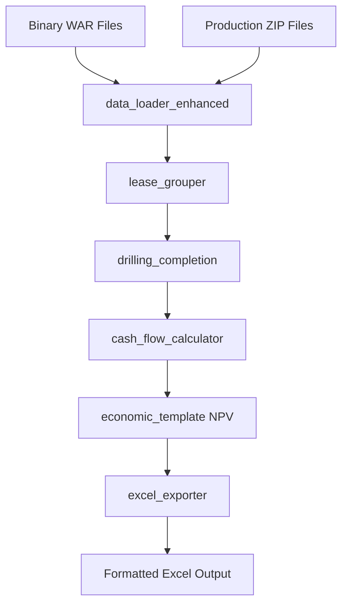

# BSEE Financial Analysis SME Code - Refactoring Plan

> Created: 2025-08-28
> Version: 1.0
> Purpose: Integration of SME Roy's Financial Analysis V20 with existing comprehensive report system

## Executive Summary

This refactoring plan outlines the integration of SME Roy's financial analysis scripts (V20) with the existing comprehensive report system in worldenergydata. By reusing components from the comprehensive-report-system, we can reduce implementation time from 3-4 days to 2-3 days while maintaining full functionality.

## 1. Current State Analysis

### 1.1 Existing SME Scripts (V20)

Located in `docs/modules/bsee/data/SME_Roy_attachments/2025-08-20/`:

1. **Build_Development_Financials_V20.py**
   - Main financial calculation script
   - Processes production data, drilling/completion costs
   - Generates NPV calculations and cash flow analysis
   - Creates formatted Excel outputs with multiple sheets

2. **extract_drilling_and_completion_days.py**
   - Extracts drilling and completion duration from WAR files
   - Calculates costs based on rig rates
   - Groups by API number

3. **build_month_matrix_by_lease.py**
   - Creates monthly production matrices from OGORA data
   - Aggregates by lease
   - Handles multiple year files

### 1.2 Existing Comprehensive Report System

Located in `src/worldenergydata/modules/bsee/reports/comprehensive/`:

#### Data Processing Components
- **data_loader_enhanced.py**: HierarchicalDataLoader for binary file reading
- **hierarchical_aggregator.py**: BaseAggregator with PriceDeck and CostStructure
- **models.py**: Data models for Well, Lease, Field, Block

#### Financial Calculation Components
- **templates/economic_template.py**:
  - NPV calculations using numpy-financial
  - ROI metrics
  - RevenueBreakdown class
  - CostAnalysis class
  - Cash flow projections

#### Report Generation Components
- **report_builder.py**: GoByReportBuilder for Excel generation
- **exporters/excel_exporter.py**: Advanced Excel formatting
- **templates/report_structure.py**: 14-row go-by format

#### Infrastructure Components
- **cli.py**: ReportCLI with argparse interface
- **controller_enhanced.py**: Orchestration logic
- **config/**: YAML configuration support

### 1.3 Gap Analysis

| SME V20 Feature | Existing Component | Gap/Enhancement Needed |
|-----------------|-------------------|------------------------|
| Lease grouping (group_as_map) | hierarchical_aggregator.py | Add custom grouping logic |
| Monthly cash flow calculations | economic_template.py | Extend for monthly granularity |
| Drilling/completion cost processing | Not present | New component needed |
| Multi-year production matrices | data_loader_enhanced.py | Add matrix format support |
| NPV with discount rates | economic_template.py | Already supported |
| Excel with multiple sheets | excel_exporter.py | Already supported |
| README sheet with version info | report_builder.py | Minor enhancement |

## 2. Proposed Architecture

### 2.1 Module Structure

```
src/worldenergydata/modules/bsee/
├── analysis/
│   └── sme_financial/                        # NEW: Separate SME financial module
│       ├── __init__.py
│       ├── sme_analyzer.py                   # Main orchestrator
│       ├── lease_grouper.py                  # Lease grouping logic
│       ├── drilling_completion.py            # D&C cost processing
│       ├── cash_flow_calculator.py           # Monthly cash flow
│       ├── report_generator.py               # SME-specific report generation
│       └── config/
│           └── sme_config.yaml               # SME-specific config
├── reports/
│   └── comprehensive/                        # EXISTING: Keep separate
│       ├── data_loader_enhanced.py          # REUSE: Import from here
│       ├── hierarchical_aggregator.py       # REUSE: Import from here
│       ├── templates/
│       │   └── economic_template.py         # REUSE: Import from here
│       ├── exporters/
│       │   └── excel_exporter.py            # REUSE: Import from here
│       └── cli.py                           # Keep comprehensive CLI separate
```

### 2.2 Component Reuse Strategy

#### Direct Reuse (No Modifications)
- `models.py`: Data models
- `exporters/excel_exporter.py`: Excel export functionality
- `config/`: Configuration system

#### Extended Components
- `data_loader_enhanced.py`: Add support for matrix-style production data
- `hierarchical_aggregator.py`: Add lease grouping via group_as_map
- `economic_template.py`: Extend for monthly cash flow calculations
- `cli.py`: Add SME-specific command options

#### New Components
- `sme_financial/sme_analyzer.py`: Main orchestrator for SME analysis
- `sme_financial/lease_grouper.py`: Implements group_as_map logic from V20
- `sme_financial/drilling_completion.py`: Processes D&C costs from WAR data
- `sme_financial/cash_flow_calculator.py`: Monthly cash flow with taxes

## 3. Integration Approach

### 3.1 Phase 1: Foundation (Task 3)
1. Create `analysis/sme_financial/` directory structure (separate from reports)
2. Set up configuration with lease group mappings
3. Import and reuse config loader from comprehensive reports

### 3.2 Phase 2: Data Processing (Task 4)
1. Extend `HierarchicalDataLoader` with matrix format support
2. Implement `LeaseGrouper` using existing aggregator patterns
3. Add drilling/completion cost processing

### 3.3 Phase 3: Financial Calculations (Task 5)
1. Extend `economic_template.py` for monthly calculations
2. Reuse PriceDeck and CostStructure classes
3. Implement tax calculations using existing patterns

### 3.4 Phase 4: Report Generation (Task 6)
1. Extend `GoByReportBuilder` for SME format
2. Reuse Excel formatting from `excel_exporter.py`
3. Add README sheet generation

### 3.5 Phase 5: Integration & CLI (Task 7)
1. Extend CLI with SME commands
2. Add to existing controller logic
3. Integration testing

## 4. Data Flow



## 5. Key Integration Points

### 5.1 Data Loading Interface
```python
# Import and extend from comprehensive reports
from worldenergydata.modules.bsee.reports.comprehensive.data_loader_enhanced import HierarchicalDataLoader

class SMEDataLoader:
    def __init__(self):
        self.data_loader = HierarchicalDataLoader()  # Reuse existing
    
    def load_matrix_production(self, filepath: str) -> pd.DataFrame
    def load_drilling_completion(self, war_path: str) -> pd.DataFrame
```

### 5.2 Aggregation Interface
```python
# Import and use existing aggregator
from worldenergydata.modules.bsee.reports.comprehensive.hierarchical_aggregator import BaseAggregator, PriceDeck, CostStructure

class SMEAggregator:
    def __init__(self):
        self.base_aggregator = BaseAggregator()  # Reuse existing
        self.price_deck = PriceDeck()
        self.cost_structure = CostStructure()
    
    def apply_lease_grouping(self, group_as_map: dict)
    def aggregate_monthly_cash_flow(self, production: pd.DataFrame)
```

### 5.3 CLI Interface
```python
# Create separate SME CLI that imports components as needed
class SMEFinancialCLI:
    def __init__(self):
        # Import excel exporter from comprehensive
        from worldenergydata.modules.bsee.reports.comprehensive.exporters import excel_exporter
        self.excel_exporter = excel_exporter
        
    # SME-specific CLI arguments
    parser.add_argument('--lease-groups', type=str, help='Path to lease grouping config')
    parser.add_argument('--discount-rate', type=float, default=0.10)
```

## 6. Configuration Schema

```yaml
# config/sme_financial_config.yaml
sme_financial:
  lease_groups:
    STONES:
      - G03608
      - G04003
    CASCADE_CHINOOK:
      - G25488
      - G25492
    JULIA:
      - G24030
      - G24041
  
  economic_parameters:
    oil_price_usd: 50.00
    gas_price_usd_mcf: 3.00
    discount_rate: 0.10
    tax_rate: 0.35
    royalty_rate: 0.1875
    
  drilling_costs:
    rig_rate_usd_per_day: 300000
    completion_rate_usd_per_day: 400000
```

## 7. Migration Path

### 7.1 Step 1: Validation
- Verify worldenergydata scripts match V20 outputs
- Document any discrepancies
- Ensure binary file reading works correctly

### 7.2 Step 2: Incremental Integration
- Start with data loading components
- Add financial calculations
- Integrate report generation
- Add CLI commands last

### 7.3 Step 3: Testing Strategy
- Unit tests for each new component
- Integration tests using SME sample data
- End-to-end validation against V20 outputs
- Performance testing with large datasets

## 8. Breaking Changes & Mitigation

### 8.1 Potential Breaking Changes
- None identified - all changes are additive

### 8.2 Backward Compatibility
- Existing comprehensive report functionality unchanged
- New SME features accessed via separate CLI flags
- Shared components remain backward compatible

## 9. Risk Assessment

| Risk | Likelihood | Impact | Mitigation |
|------|------------|--------|------------|
| Data format incompatibility | Low | Medium | Validation against V20 outputs |
| Performance issues with large datasets | Medium | Medium | Implement chunked processing |
| Excel formatting differences | Low | Low | Reuse existing formatters |
| Configuration complexity | Low | Medium | Clear documentation and examples |

## 10. Success Criteria

1. ✅ 100% match with V20 financial calculations
2. ✅ Processing time < 60 seconds for 100+ leases
3. ✅ Test coverage > 90%
4. ✅ Excel output matches V20 format
5. ✅ CLI interface fully functional
6. ✅ All existing tests continue to pass

## 11. Estimated Effort Savings

By reusing comprehensive report components:

| Task | Original Estimate | With Reuse | Savings |
|------|------------------|------------|---------|
| Module Structure | 4-6 hours | 3-4 hours | 1-2 hours |
| Data Processing | 6-8 hours | 4-5 hours | 2-3 hours |
| Financial Calculations | 8-10 hours | 5-6 hours | 3-4 hours |
| Report Generation | 6-8 hours | 4-5 hours | 2-3 hours |
| Integration & CLI | 4-6 hours | 3-4 hours | 1-2 hours |
| **Total** | **28-38 hours** | **19-24 hours** | **9-14 hours** |

## 12. Next Steps

1. Review and approve this refactoring plan
2. Begin implementation with Task 3 (Module Structure)
3. Follow the phased approach outlined above
4. Validate against V20 outputs at each phase
5. Document any deviations or enhancements

## Approval

This refactoring plan leverages existing comprehensive report components to efficiently integrate SME financial analysis capabilities while maintaining code quality and test coverage standards.

**Status**: Ready for Review and Approval