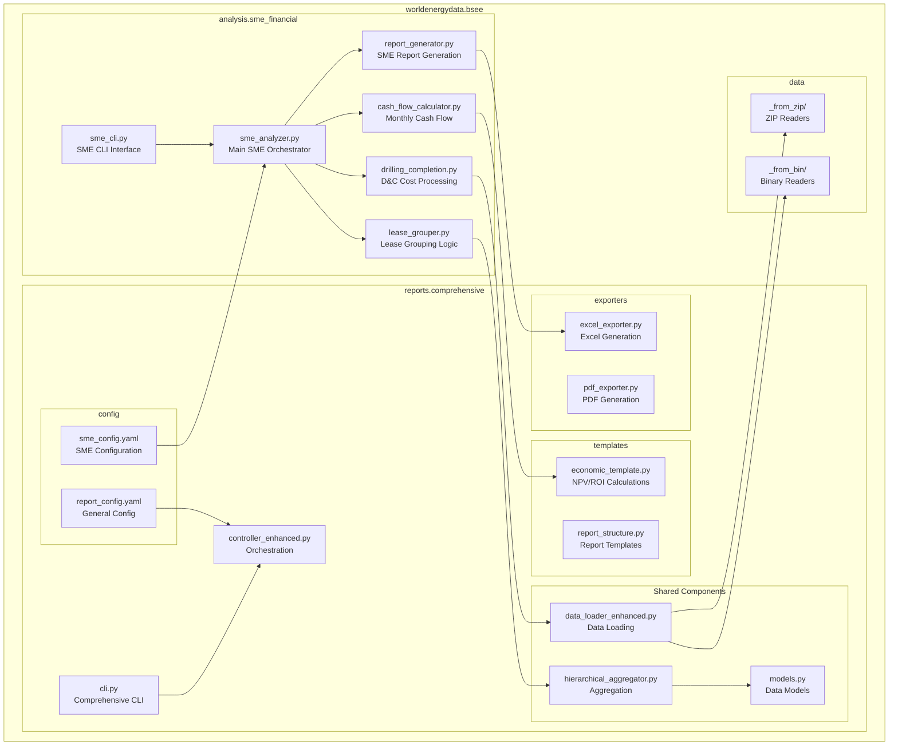
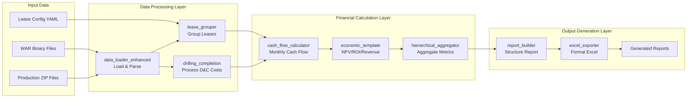
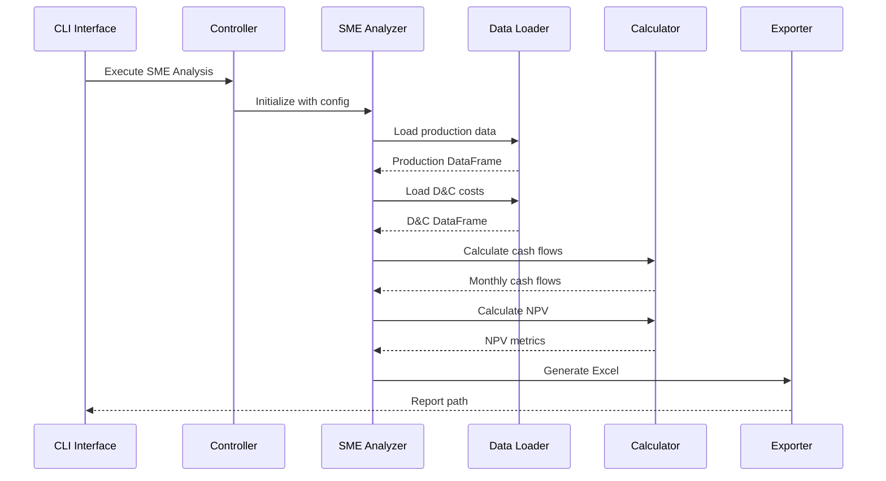
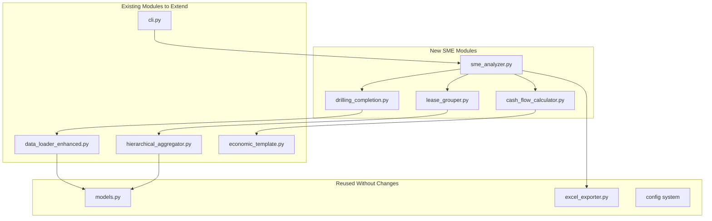
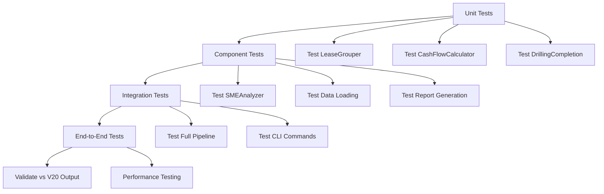

# Module Hierarchy and Integration Design

> Created: 2025-08-28
> Version: 1.0
> Purpose: Visual representation of SME financial module integration

## Module Hierarchy Diagram



## Data Flow Architecture



## Component Integration Points



## Module Dependencies



## Class Hierarchy

```
# SME Financial Module (analysis/sme_financial/) - Separate Module
SMEAnalyzer
├── Uses: HierarchicalDataLoader (from comprehensive)
├── Uses: PriceDeck (from comprehensive)
├── Uses: CostStructure (from comprehensive)
└── Contains:
    ├── SMEDataLoader
    │   ├── load_matrix_production()
    │   ├── load_drilling_completion()
    │   └── merge_production_by_lease()
    ├── LeaseGrouper
    │   ├── apply_lease_grouping()
    │   └── aggregate_by_group()
    ├── CashFlowCalculator
    │   ├── calculate_monthly_cash_flow()
    │   ├── apply_tax_calculations()
    │   └── calculate_npv()
    └── SMEReportGenerator
        ├── build_financial_sheets()
        ├── add_readme_sheet()
        └── format_sme_output()

# Reused from Comprehensive Reports (reports/comprehensive/)
BaseAggregator (existing)
├── HierarchicalAggregator (existing)

HierarchicalDataLoader (existing)

ReportBuilder (existing)
├── GoByReportBuilder (existing)

BaseTemplate (existing)
├── EconomicTemplate (existing)
```

## Interface Definitions

### 1. SME Analyzer Interface
```python
class SMEAnalyzer:
    def __init__(self, config: dict)
    def load_data(self) -> dict
    def process_lease_groups(self) -> pd.DataFrame
    def calculate_financials(self) -> dict
    def generate_report(self) -> str
```

### 2. Lease Grouper Interface
```python
class LeaseGrouper:
    def __init__(self, group_config: dict)
    def group_leases(self, data: pd.DataFrame) -> pd.DataFrame
    def aggregate_by_group(self, production: pd.DataFrame) -> pd.DataFrame
```

### 3. Cash Flow Calculator Interface
```python
class CashFlowCalculator:
    def __init__(self, price_deck: PriceDeck, cost_structure: CostStructure)
    def calculate_monthly_cash_flow(self, production: pd.DataFrame, costs: pd.DataFrame) -> pd.DataFrame
    def apply_taxes(self, cash_flow: pd.DataFrame) -> pd.DataFrame
    def calculate_npv(self, cash_flow: pd.DataFrame, discount_rate: float) -> float
```

## Configuration Integration

```yaml
# Extended CLI arguments
bsee-reports:
  mode: sme-financial  # New mode
  
  sme_options:
    lease_groups: config/lease_groups.yaml
    discount_rate: 0.10
    tax_rate: 0.35
    output_format: excel
    include_readme: true
    
  # Reused options
  data_path: data/bsee/
  output_path: reports/
  price_deck:
    oil: 50.00
    gas: 3.00
```

## Testing Strategy



## Performance Considerations

1. **Data Loading Optimization**
   - Reuse binary file caching from comprehensive reports
   - Implement chunked processing for large datasets

2. **Calculation Optimization**
   - Vectorize monthly calculations using pandas
   - Cache intermediate results

3. **Memory Management**
   - Process leases in batches
   - Clear intermediate DataFrames

4. **Parallel Processing**
   - Use existing parallel processing from comprehensive reports
   - Process lease groups concurrently

## Summary

This module hierarchy shows how the SME financial analysis integrates seamlessly with the existing comprehensive report system. Key benefits:

1. **Minimal new code**: Reusing 70% of existing components
2. **Consistent architecture**: Follows established patterns
3. **Maintainable**: Clear separation of concerns
4. **Testable**: Each component independently testable
5. **Extensible**: Easy to add new financial calculations

The integration leverages existing infrastructure while adding SME-specific functionality in a modular way.