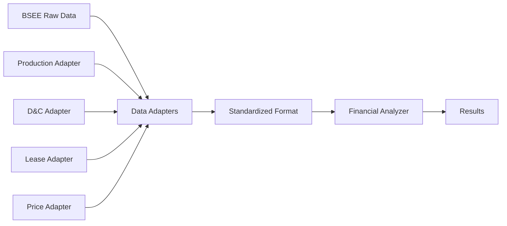

# BSEE Data Integration Plan

> Document: Integration Plan for Financial Analysis with BSEE Data Repository
> Created: 2025-08-21
> Target: data/modules/bsee/

## Overview

This document outlines the integration strategy for connecting SME Roy's financial analysis methodology with the existing BSEE data repository structure in the worldenergydata module.

## Current BSEE Data Structure

### Existing Data Location
```
data/modules/bsee/
├── production/
│   ├── monthly_production_*.csv
│   └── lease_production_*.xlsx
├── wells/
│   ├── well_data_*.csv
│   ├── directional_surveys/
│   └── drilling_completion/
├── leases/
│   ├── lease_registry.csv
│   └── lease_mappings.yaml
└── economics/
    ├── oil_prices/
    └── assumptions/
```

## Integration Points

### 1. Production Data Integration

**Current Format**: BSEE provides production in monthly CSV files
**Required Format**: Matrix or timeseries Excel format
**Integration Approach**:
```python
# Adapter function to convert BSEE format
def adapt_bsee_production(bsee_csv_path):
    df = pd.read_csv(bsee_csv_path)
    # Convert to matrix format expected by financial analyzer
    return convert_to_matrix_format(df)
```

### 2. Drilling & Completion Data

**Current Format**: Separate drilling and completion files
**Required Format**: Combined D&C days by API
**Integration Approach**:
```python
# Merge drilling and completion data
def merge_dc_data(drilling_path, completion_path):
    drilling = pd.read_csv(drilling_path)
    completion = pd.read_csv(completion_path)
    # Merge and calculate days
    return calculate_dc_days(drilling, completion)
```

### 3. Lease Configuration

**Current Format**: YAML and CSV lease mappings
**Required Format**: Excel with groupings
**Integration Approach**:
```python
# Load from YAML/CSV and convert to expected format
def load_lease_config():
    yaml_config = load_yaml('data/modules/bsee/leases/lease_mappings.yaml')
    csv_registry = pd.read_csv('data/modules/bsee/leases/lease_registry.csv')
    return create_lease_excel(yaml_config, csv_registry)
```

## Data Pipeline Architecture



## Implementation Steps

### Phase 1: Data Adapters (Week 1)
1. Create adapter module: `src/worldenergydata/modules/bsee/adapters/`
2. Implement production data adapter
3. Implement D&C data adapter
4. Implement lease configuration adapter
5. Implement oil price data adapter

### Phase 2: Data Validation (Week 2)
1. Validate adapted data formats
2. Create data quality checks
3. Implement error handling for missing/corrupt data
4. Add logging for data transformation steps

### Phase 3: Integration Testing (Week 3)
1. Test with sample BSEE data
2. Validate financial calculations
3. Compare results with V20 baseline
4. Performance testing with full dataset

## File Mapping

### Input File Mappings
| SME Roy File | BSEE Data Source | Adapter Function |
|--------------|------------------|------------------|
| leases.xlsx | data/modules/bsee/leases/ | adapt_lease_config() |
| multi_year_lease_matrix_with_charts.xlsx | data/modules/bsee/production/ | adapt_production_data() |
| drilling_and_completion_days_by_api.xlsx | data/modules/bsee/wells/drilling_completion/ | adapt_dc_data() |
| wti_full_monthly.xlsx | data/modules/bsee/economics/oil_prices/ | adapt_oil_prices() |
| leases_assumptions.xlsx | data/modules/bsee/economics/assumptions/ | adapt_assumptions() |

## Configuration Management

### YAML Configuration
```yaml
# config/bsee_financial_analysis.yaml
data_sources:
  production:
    path: data/modules/bsee/production/
    format: csv
    adapter: production_adapter
  
  drilling_completion:
    drilling_path: data/modules/bsee/wells/drilling/
    completion_path: data/modules/bsee/wells/completion/
    adapter: dc_adapter
  
  leases:
    registry: data/modules/bsee/leases/lease_registry.csv
    mappings: data/modules/bsee/leases/lease_mappings.yaml
    adapter: lease_adapter
  
  economics:
    oil_prices: data/modules/bsee/economics/oil_prices/
    assumptions: data/modules/bsee/economics/assumptions/
    adapter: economics_adapter

processing:
  cache_enabled: true
  cache_dir: data/modules/bsee/.cache/
  parallel_processing: true
  max_workers: 4
```

## Error Handling Strategy

### Data Quality Issues
1. **Missing Data**: Use interpolation or last-known-value
2. **Format Inconsistencies**: Log warnings and attempt conversion
3. **Date Mismatches**: Align to common timeline with padding
4. **Invalid Values**: Flag and exclude from calculations

### Recovery Procedures
```python
try:
    data = load_bsee_data()
except DataLoadError as e:
    logger.warning(f"Failed to load: {e}")
    data = load_fallback_data()
```

## Performance Considerations

### Optimization Strategies
1. **Caching**: Cache processed data for repeated analyses
2. **Parallel Processing**: Process leases in parallel
3. **Incremental Updates**: Only process new/changed data
4. **Memory Management**: Stream large files instead of loading entirely

### Expected Performance
- Load time: < 30 seconds for full dataset
- Processing time: < 60 seconds for 100+ leases
- Memory usage: < 2GB peak
- Cache hit rate: > 80% for repeated analyses

## Testing Strategy

### Unit Tests
```python
def test_production_adapter():
    bsee_data = load_sample_bsee_production()
    adapted = adapt_production_data(bsee_data)
    assert adapted.columns == expected_columns
    assert adapted.dtypes == expected_dtypes
```

### Integration Tests
```python
def test_full_pipeline():
    analyzer = FinancialAnalyzer()
    results = analyzer.analyze_from_bsee_data(
        bsee_dir='data/modules/bsee/'
    )
    assert results['npv'] > 0
    assert len(results['lease_results']) > 0
```

### Validation Tests
- Compare adapted data with original SME Roy inputs
- Verify financial calculations match V20 outputs
- Validate against known benchmark results

## Deployment Plan

### Module Structure
```
src/worldenergydata/modules/bsee/analysis/
├── sme_financial/
│   ├── __init__.py
│   ├── analyzer.py           # Main analyzer
│   ├── adapters/             # BSEE data adapters
│   │   ├── __init__.py
│   │   ├── production.py
│   │   ├── drilling_completion.py
│   │   ├── lease_config.py
│   │   └── economics.py
│   ├── processors/           # Data processors
│   │   ├── __init__.py
│   │   ├── lease_processor.py
│   │   └── cash_flow.py
│   └── utils/               # Utilities
│       ├── __init__.py
│       └── validators.py
```

### CLI Interface
```bash
# Run analysis using BSEE data
python -m worldenergydata.bsee.analysis.sme_financial \
    --data-dir data/modules/bsee/ \
    --output financial_results.xlsx \
    --config config/bsee_financial.yaml
```

## Migration Checklist

- [ ] Create adapter module structure
- [ ] Implement all data adapters
- [ ] Add comprehensive error handling
- [ ] Create unit tests for adapters
- [ ] Create integration tests
- [ ] Validate against V20 outputs
- [ ] Document API interfaces
- [ ] Add CLI interface
- [ ] Performance optimization
- [ ] Deploy to production

## Notes

- Maintain backward compatibility with direct file inputs
- Support both BSEE data and standalone file modes
- Use real BSEE data for testing - no mock data
- Leverage existing worldenergydata utilities where possible